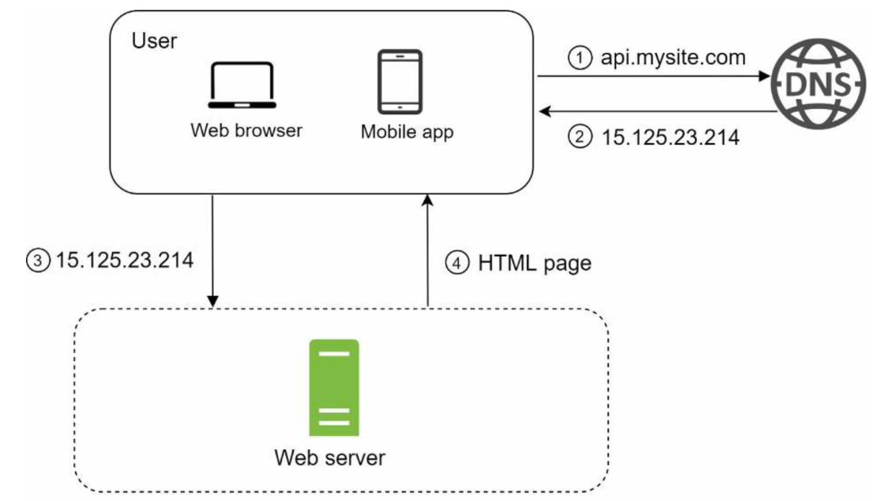
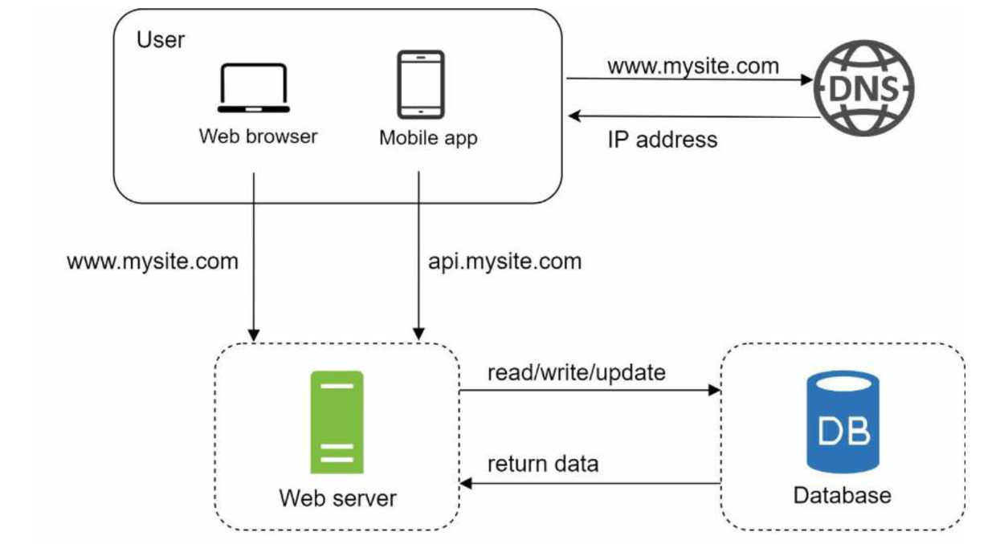
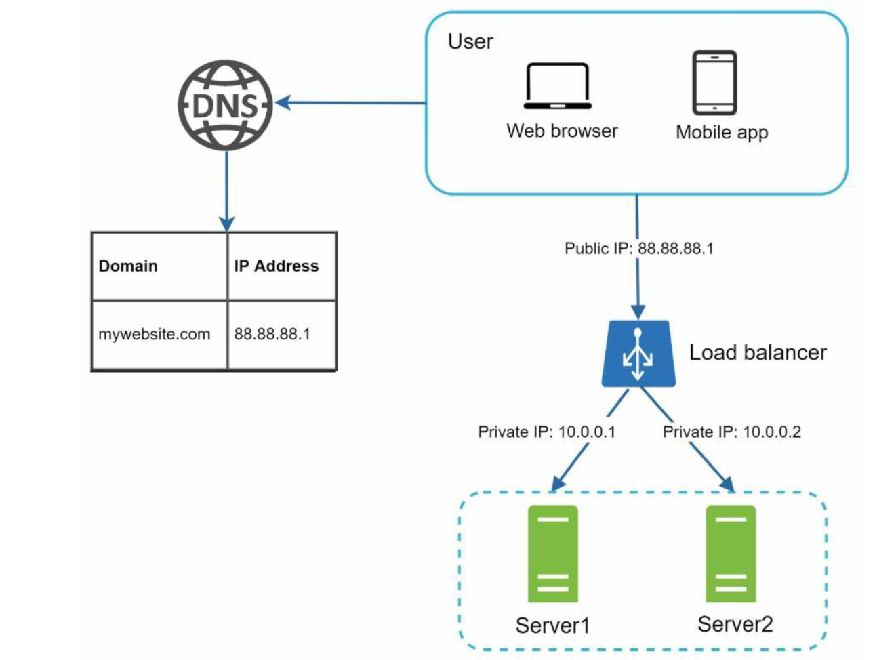

# 1장. 사용자 수에 따른 규모 확장성

# 단일 서버

- 모든 컴포넌트가 단 한 대의 서버에서 실행되는 시스템
- 웹 앱, 데이터베이스, 캐시 등 전부 서버 한 대에서 실행

## 사용자 요청 흐름



1. 사용자는 도메인 이름(api.mysite.com)을 이용하여 웹사이트에 접속한다.
    - 이 접속을 위해서는 도메인 이름을 DNS(Domain Name Service)에 질의하여 IP 주소로 변환해야 한다.
    - DNS는 보통 제3 사업자가 제공하는 유료 서비스를 이용(우리 시스템의 일부 x)
2. DNS 조회 결과로 IP 주소가 반환된다.
3. 해당 IP 주소로 HTTP(HyperText Transfer Protocol) 요청이 전달된다.
4. 요청을 받은 웹 서버는 HTML 페이지나 JSON 형태의 응답을 반환한다.

## 실제 요청은 어디서 오는가?

실제 요청들은 **웹 앱**과 **모바일 앱,** 이 두 가지 종류의 단말로부터 온다.

**웹 에플리케이션**: 비즈니스 로직, 데이터 저장 등을 처리하기 위해서는 서버 구현용 언어(자바, 파이썬 등)를 사용하고, 프레젠테이션용으로는 클라이언트 구현용 언어 (HTML, 자바스크립트 등)를 사용한다 

**모바일 앱**: 모바일 앱과 웹 서버 간 통신을 위해서는 HTTP 프로토콜을 이용한다. HTTP 프로토콜을 통해서 반환될 응답 데이터의 포맷으로는 보통 JSON(JavaScript Object Notation)이 많이 쓰인다.

```json
{
	"id": 12,
	"firstName" : "John",
	"lastName" : "Smith",
	"address" : {
		"streetAddress": "21 2nd Street",
		"city": "New Tork",
		"state": "NY",
		"postalCode": 10021
	},
	"phoneNumber": [
		"212 555-1234",
		"646 555-4567"
	]
}

```

# 데이터베이스

사용자가 늘면 서버 하나로는 충분하지 않아서 여러 서버를 두어야 한다.

하나는 웹/모바일 트래픽 처리 용도, 다른 하나는 데이터베이스용이다.

웹/모바일 트래픽 처리 서버(웹 계층)와 데이터베이스 서버(데이터 계층)를 분리하면 그 각각을 독립적으로 확장해 나갈 수 있게 된다.



## 어떤 데이터베이스를 사용할 것인가?

### 관계형 데이터베이스(relational database) vs 비-관계형 데이터베이스

**관계형 데이터베이스:**

- 관계형 데이터베이스 관리 시스템(Relational Database Management System, RDBMS)라고도 부른다.
- MySQL, 오라클 데이터베이스, PostgreSQL 등이 있다.
- 자료를 테이블과 열, 칼럼으로 표현
- SQL을 사용하면 여러 테이블에 있는 데이터를 그 관계에 따라 조인(join)하여 합칠 수 있다.

**비관계형 데이터베이스**:

- NoSQL이라고 부른다.
- CouchDB, Neo4j, Cassandra, HBase, Amazon DynamoDB 등이 있다.
- 키-값 저장소(key-value store), 그래프 저장소(graph store), 칼럼 저장소(column store), 문서 저장소(document store) 로 나눌 수 있다.
- 비-관계형 데이터베이스는 일반적으로 조인 연산은 지원하지 않는다.

### 비관계형 데이터베이스가 바람직한 선택인 경우

- 아주 낮은 응답 지연시간(latency)이 요구됨
- 다루는 데이터가 비정형(unstructured)이라 관계형 데이터가 아님
- 데이터(JSON, YAML, XML 등)를 직렬화하거나(serialize) 역직렬화(deserialize) 할 수 있기만 하면 됨
- 아주 많은 양의 데이터를 저장할 필요가 있음

# 수직적 규모 확장 vs 수평적 규모 확장

## 수직적 규모 확장 프로세스 = 스케일 업(scale up)

- 서버에 고사양 자원(더 좋은 CPU, 더 많은 RAM 등)을 추가하는 행위를 말한다.

## 수평적 규모 확장 프로세스 = 스케일 아웃(scale out)

- 더 많은 서버를 추가하여 성능을 개선하는 행위를 말한다.

## 수직적 확장의 단점

서버로 유입되는 트래픽의 양이 적을 때는 수직적 확장이 좋은 선택이며, 이 방법의 가장 큰 장점은 단순함이다. 

- 수직적 규모 확장에는 한계가 있다. 한 대의 서버에 CPU나 메모리를 무한대로 증설할 방법이 없다.
- 수직적 규모 확장법은 장애에 대한 자동복구(failover) 방안이나 다중화(redundancy) 방안을 제시하지 않는다.
    - 서버에 장애가 발생하면 웹사이트/웹은 완전히 중단된다.

이런 단점 때문에, 대규모 애플리케이션을 지원하는 데는 수평적 규모 확장법이 보다 적절하다.

앞서 본 설계에서 사용자는 웹 서버로 바로 연결된다.

- 웹 서버가 다운되면 사용자는 웹 사이트에 접속할 수 없다.
- 너무 많은 사용자가 접속하여 웹 서버가 한계 상황에 도달하게 되면 응답 속도가 느려지거나 서버 접속이 불가능해질 수도 있다.
- 이런 문제를 해결하는 데는 부하 분산기 or 로드밸런서를 도입하는 것이 최선이다.

# 로드밸런서(load balancer)

부하 분산 집합(load balancing set)에 속한 웹 서버들에게 트래픽 부하를 고르게 분산하는 역할을 한다.



- 사용자는 로드밸런서의 공개 IP 주소(public IP address)로 접속한다
    - 웹 서버는 클라이언트의 접속을 직접 처리하지 않는다.
    - 서버 간 통신에는 보안을 위해서 사설 IP 주소(private IP address)가 이용된다.
- 사설 IP 주소는 같은 네트워크에 속한 서버 사이의 통신에만 쓰일 수 있는 IP 주소로, 인터넷을 통해서는 접속할 수 없다.
- 로드밸런서는 웹 서버와 통신하기 위해 바로 이 사설 주소를 이용한다.

## 동작 과정

- 서버 1이 다운되면(offline) 모든 트래픽은 서버 2로 전송된다.
    - 웹사이트 전체가 다운되는 일이 방지된다.
    - 부하를 나누기 위해 새로운 서버를 추가할 수 있다.
- 웹사이트로 유입되는 트래픽이 가파르게 증가하면 두 대의 서버로 트래픽을 감당할 수 없는 시점이 오는데, 로드밸런서가 있으므로 우아하게 대처할 수 있다.
    - 웹 서버 계층에 더 많은 서버를 추가하기만 하면 된다.
    - 그러면 로드밸런스가 자동적으로 트래픽을 분산하기 시작할 것이다

# 데이터베이스 다중화

“많은 데이터베이스 관리 시스템이 다중화를 지원한다. 보통은 서버 사이에 주(master)-부(slave) 관계를 설정하고 데이터 원본은 주 서버에, 사본은 부 서버에 저장하는 방식이다” - 위키피디아

- 쓰기 연산(write operation)은 마스터에서만 지원한다.
- 부 데이터베이스는 주 데이터베이스로부터 그 사본을 전달받으며, 읽기 연산(read operation)만을 지원한다.
- 데이터베이스를 변경하는 명령어들(insert, delete, update)은 주 데이터베이스로만 전달되어야 한다.
- 대부분의 애플리케이션은 읽기 연산의 비중이 쓰기 연산보다 훨씬 높다.
    - 통상 부 데이터베이스의 수가 주 데이터베이스의 수보다 많다.


## 데이터베이스 다중화 이점

- **더 나은 성능**: 주-부 다중화 모델에서 모든 데이터 변경 연산은 주 데이터베이스 서버로만 전달되는 반면 읽기 연산은 부 데이터베이스 서버들로 분산된다.
    - 병렬로 처리될 수 있는 질의(query)의 수가 늘어나므로, 성능이 좋아진다.
- 안정성(reliability): 자연 재해 등의 이유로 데이터베이스 서버 가운데 일부가 파괴되어도 데이터는 보존될 것이다.
    - 데이터를 지역적으로 떨어진 여러 장소에 다중화시켜 놓을 수 있기 때문이다.
- 가용성(availability): 데이터를 여러 지역에 복제해 둠으로써, 하나의 데이터베이서 서버에 장애가 발생하더라도 다른 서버에 있는 데이터를 가져와 계속 서비스 할 수 있게 된다.

## 데이터베이스 서버 가운데 하나가 다운되면 무슨 일이 벌어지는가?

- 부 서버가 한 대 뿐인데 다운된 경우라면, 읽기 연산은 한시적으로 모두 주 데이터베이스로 전달될 것이다. 또한 즉시 새로운 부 데이터베이스 서버가 장애 서버를 대체할 것이다.
    
    부 서버가 여러 대인 경우에 읽기 연산은 나머지 부 데이터베이스 서버들로 분산될 것이며, 새로운 부 데이터베이스 서버가 장애 서버를 대체할 것이다.
    
- 주 데이터베이스 서버가 다운되면, 한 대의 부 데이터베이스만 있는 경우 해당 부 데이터베이스 서버가 새로운 주 서버가 될 것이며, 모든 데이터베이스 연산은 일시적으로 새로운 주 서버상에서 수행될 것이다.
    
    프로덕션(production) 환경에서 벌어지는 일은 이것보다 사실 더 복잡한데, 부 서버에 보관된 데이터가 최신 상태가 아닐 수 있기 때문이다.
    
    - 없는 데이터는 복구 스크립트(recovery script)를 돌려서 추가해야 한다.
    - 다중 마스터나 원형 다중화 방식을 도입하면 이런 상황에 대처하는 데 도움이 될 수도 있지만 해당 구성은 훨씬 복잡하다.


## 동작 과정

- 사용자는 DNS로부터 로드밸런서의 공개 IP 주소를 받는다.
- 사용자는 해당 IP 주소를 사용해 로드밸런서에 접속한다.
- HTTP 요청은 서버 1이나 서버 2로 전달된다.
- 웹 서버는 사용자의 데이터를 부 데이터베이스 서버에서 읽는다.
- 웹 서버는 데이터 변경 연산은 주 데이터베이스로 전달한다. 데이터 추가, 삭제, 갱신 연산 등이 이에 해당한다.

## 응답시간(latency) 개선

- 응답 시간은 캐시를 붙이고 정적 콘텐츠를 콘텐츠 전송 네트워크(Content Delivery Network, CDN)로 옮기면 개선할 수 있다.

# 캐시(Cache)

- 값비싼 연산 결과 또는 자주 참조되는 데이터를 메모리 안에 두고, 뒤이은 요청이 보다 빨리 처리될 수 있도록 하는 저장소
- 애플리케이션의 성능은 데이터베이스를 얼마나 자주 호출하느냐에 크게 좌우되는데, 캐시는 그런 문제를 완화할 수 있다.

## 캐시 계층

- 데이터가 잠시 보관되는 곳으로 데이터베이스보다 훨씬 빠르다.
    - 성능 개선, 데이터베이스 부하 줄임, 캐시 계층의 규모를 독립적으로 확장 가능


1. 만일 데이터가 캐시에 있으면 캐시에서 데이터를 읽음
2. 데이터가 캐시에 없으면 데이터베이스에서 해당 데이터를 읽어 캐시에 씀
3. 웹 서버에 데이터 반환

읽기 주도형 캐시 전략

## 캐시 사용 시 유의할 점

- 캐시는 어떤 상황에 바람직한가?
    - 데이터 갱신은 자주 일어나지 않지만 참조는 빈번하게 일어난다면 고려해볼 만하다.
- 어떤 데이터를 캐시에 두어야 하는가?
    - 캐시는 데이터를 휘발성 메모리에 두므로, 영속적으로 보관할 데이터를 캐시에 두는 것은 바람직하지 않다.
    - 캐시 서버가 재시작되면 캐시 내의 모든 데이터는 사라진다.
    - 중요 데이터는 여전히 지속적 저장소(persistent data store)에 두어야 한다.
- 캐시에 보관된 데이터는 어떻게 만료(expire)되는가?
    - 만료된 데이터는 캐시에서 삭제되어야 한다.
    - 만로 정책이 없으면 데이터는 캐시에 계속 남게 된다.
    - 만료 기한은 너무 짧거나 길면 안된다.
        - 짧으면, 데이터베이스를 너무 자주 읽게 될 것이기 때문이다.
        - 길면, 원본과 차이가 날 가능성이 높아지기 때문이다.
- 일관성(consistency)은 어떻게 유지되는가?
    - 일관성은 데이터 저장소의 원본과 캐시 내의 사본이 같은지 여부다.
    - 저장소의 원본을 갱신하는 연산과 캐시를 갱신하는 연산이 단일 트랜잭션으로 처리되지 않는 경우 이 일관성은 깨질 수 있다.
    - 여러 지역에 걸쳐 시스템을 확장해 나가는 경우 캐시와 저장소 사이의 일관성을 유지하는 것은 어려운 문제가 된다.
- 장애에는 어떻게 대처할 것인가?
    - 캐시 서버를 한 대만 두는 경우 해당 서버는 단일 장애 지점(Single Point of Failure, SPOF)이 되어버릴 가능성이 있다.
    - SPOF를 피하려면 여러 지역에 걸쳐 캐시 서버를 분산시켜야 한다.
    
    
    
- 캐시 메모리는 얼마나 크게 잡을 것인가?
    - 캐시 메모리가 너무 작으면 데이터가 너무 자주 캐시에서 밀려나버려(eviction) 캐시의 성능이 떨어지게 된다.
    - 이를 막을 한 가지 방법은 캐시 메모리를 과할당(overProvision)하는 것이다.
    - 이렇게 하면 캐시에 보관될 데이터가 갑자기 늘어났을 때 생길 문제도 방지할 수 있게 된다.
- 데이터 방출(eviction) 정책은 무엇인가?
    - 캐시가 꽉 차버리면 추가로 캐시에 데이터를 넣어야 할 경우 기존 데이터를 내보내야 한다.
    - **LRU(Least Recently Used - 마지막으로 사용된 시점이 가장 오래된 데이터를 내보내는 정책)**
    - **LFU(Least Frequently Used - 사용된 빈도가 가장 낮은 데이터를 내보내는 정책)**
    - **FIFO(First In First Out - 가장 먼저 캐시에 들어온 데이터를 가장 먼저 내보내는 정책)**

# 콘텐츠 전송 네트워크(CDN)

- CDN은 정적 콘텐츠를 전송하는 데 쓰이는, 지리적으로 분산된 서버의 네트워크이다.
- 이미지, 비디오, CSS, JavaScript 파일 등을 캐시할 수 있다.
- 어떤 사용자가 웹사이트를 방문하면, 그 사용자에게 가장 가까운 CDN 서버가 정적 콘텐츠를 전달하게 된다.
    - 사용자가 CDN 서버로부터 멀면 멀수록 웹사이트는 천천히 로드될 것이다.


## CDN 동작과정

1. 사용자 A가 이미지 URL을 이용해 image.png에 접근한다. URL의 도메인은 CDN 서비스 사업자가 제공한 것이다.
2. CDN 서버의 캐시에 해당 이미지가 없는 경우, 서버는 원본(origin) 서버에 요청하여 파일을 가져온다.
    - 원본 서버는 웹 서버일 수도 있고 아마존 S3같은 온라인 저장소일 수도 있다.
3. 원본 서버가 파일을 CDN 서버에 반환한다. 
    - 응답의 HTTP 헤더에는 해당 파일이 얼마나 오래 캐시될 수 있는지를 설명하는 TTL(Time-To-Live) 값이 들어 있다.
4. CDN 서버는 파일을 캐시하고 사용자 A에게 반환한다. 이미지는 TTL에 명시된 시간이 끝날 때까지 캐시된다.
5. 사용자 B가 같은 이미지에 대한 요청을 CDN 서버에 전송한다.
6. 만료되지 않은 이미지에 대한 요청은 캐시를 통해 처리된다.

## CDN 사용 시 고려해야 할 사항

- 비용: CDN은 보통 제 3 사업자(third-party providers)에 의해 운영되며, CDN으로 들어가고 나가는 데이터 전송 양에 따라 요금을 내게 된다.
    - 자주 사용되지 않는 콘텐츠를 캐싱하는 것은 이득이 크지 않으므로, CDN에서 빼는 것을 고려해야 한다.
- 적절한 만료 시한 설정: 시의성이 중요한(time-sensitive) 콘텐츠의 경우 만료 시점을 잘 정해야 한다.
    - 너무 길면 콘텐츠의 신선도가 떨어질 것이고, 너무 짧으면 원본 서버에 빈번히 접속하게 되어서 좋지 않다.
- CDN 장애에 대한 대처 방안: CDN 자체가 죽었을 경우 웹사이트/애플리케이션이 어떻게 동작해야 하는지 고려해야 한다.
    - 가령 일시적으로 CDN이 응답하지 않는 경우, 해당 문제를 감지하여 원본 서버로부터 직접 콘텐츠를 가져오도록 클라이언트를 구성하는 것이 필요할 수도 있다.
- 콘텐츠 무효화(invalidation) 방법: 아직 만료되지 않은 콘텐츠라 하더라도 아래 방법 가운데 하나를 쓰면 CDN에서 제거할 수 있다.
    - CDN 서비스 사업자가 제공하는 API를 이용하여 콘텐츠 무효화
    - 콘텐츠의 다른 버전을 서비스하도록 오브젝트 버저닝(object versioning) 이용
        - 콘텐츠의 새로운 버전을 지정하기 위해서는 URL 마지막에 버전 번호를 인자로 주면 된다.
        - image.png?v=2


- 정적 콘텐츠(JS, CSS, 이미지 등)는 더 이상 웹 서버를 통해 서비스하지 않으며, CDN을 통해 제공하여 더 나은 성능을 보장한다.
- 캐시가 데이터베이스 부하를 줄여준다.

# 무상태(stateless) 웹 계층

상태 정보(사용자 세션 데이터와 같은)를 웹 계층에서 제거하여야 한다.

- 상태 정보를 관계형 데이터베이스나 NoSQL 같은 지속성 저장소에 보관하고, 필요할 때 가져오도록 하는 것이다.

## 상태 정보 의존적인 아키텍처

- 상태 정보를 보관하는 서버는 클라이언트 정보, 즉 상태를 유지하여 요청들 사이에 공유되도록 한다.


- 그림과 같이 같은 클라이언트로부터의 요청은 항상 같은 서버로 전송되어야 한다.
- 대부분의 로드밸런서가 이를 지원하기 위해 고정 세션(sticky session)이라는 기능을 제공하고 있는데, 이는 로드밸런서에 부담을 준다.
- 게다가 로드밸런서 뒷단에 서버를 추가하거나 제거하기도 까다로워진다.
- 서버의 장애를 처리하기도 복잡해진다.

## 무상태 아키텍처


- 사용자로부터의 HTTP 요청은 어떤 웹 서버로도 전달될 수 있다.
- 웹 서버는 상태 정보가 필요한 경우 공유 저장소로부터 데이터를 가져온다.
- 따라서 상태 정보는 웹 서버로부터 물리적으로 분리되어 있다.
- 이런 구조는 단순하고, 안정적이며, 규모 확장이 쉽다.


- 세션 데이터를 웹 계층에서 분리하고 지속성 데이터 보관소에 저장하도록 만들었다.
- 이 공유 저장소는 관계형 데이터베이스일 수도 있고, Memcached/Redis 같은 캐시 시스템일 수도 있으며, NoSQL일 수도 있다.
- Auto scale은 트래픽 양에 따라 웹 서버를 자동으로 추가하거나 삭제하는 기능을 뜻한다.
- 상태 정보가 웹 서버들로부터 제거되었으므로, 트래픽 양에 따라 웹 서버를 넣거나 빼기만 하면 자동으로 규모를 확장할 수 있게 된다.

# 데이터 센터

- 장애가 없는 상황에서 사용자는 가장 가까운 데이터 센터로 안내되는데, 통상 이 절차를 지리적 라우팅(geoDNS-routing)이라고 부른다.
- 지리적 라우팅에서의 geoDNS는 사용자의 위치에 따라 도메인 이름을 어떤 IP 주소로 변환할지 결정할 수 있도록 해 주는 DNS 서비스다.


- 이들 데이터 센터 중 하나에 심각한 장애가 발생하면 모든 트래픽은 장애가 없는 데이터 센터로 전송된다.

## 다중 데이터센터 아키텍처 기술적 난제

- 트래픽 우회
    - 올바른 데이터 센터로 트래픽을 보내는 효과적인 방법을 찾아야 한다.
    - GeoDNS는 사용자에게서 가장 가까운 데이터센터로 트래픽을 보낼 수 있도록 해 준다.
- 데이터 동기화(synchronization)
    - 데이터 센터마다 별도의 데이터베이스를 사용하고 있는 상황이라면, 장애가 자동으로 복구되어(failover) 트래픽이 다른 데이터베이스로 우회된다 해도, 해당 데이터센터에는 찾는 데이터가 없을 수 있다.
    - 데이터를 여러 데이터센터에 걸쳐 다중화함으로써 막을 수 있다.
- 테스트와 배포(deployment)
    - 웹 사이트 또는 애플리케이션을 여러 위치에서 테스트해 보는 것이 중요하다.
    - 한편, 자동화된 배포 도구는 모든 데이터 센터에 동일한 서비스가 설치되도록 하는 데 중요한 역할을 한다.

# 메시지 큐

- 메시지의 무손실(durability, 즉 메시지 큐에 일단 보관된 메시지는 소비자가 꺼낼 때까지 안전히 보관된다는 특성)을 보장하는, 비동기 통신(asynchronous communication)을 지원하는 컴포넌트다.
- 메시지의 버퍼 역할을 하며, 비동기적으로 전송한다.
- 생산자 또는 발행자(producer/publisher)라고 불리는 입력 서비스가 메시지를 만들어 메시지 큐에 발행(publish)한다.
- 큐에는 보통 소비자 혹은 구독자(consumer/subscriber)라 불리는 서비스 혹은 서버가 연결되어 있는데, 메시지를 받아 그에 맞는 동작을 수행하는 역할을 한다.

## 메시지 큐 장점

- 서비스 또는 서버 간 결합이 느슨해져서, 규모 확장성이 보장되어야 하는 안정적 애플리케이션을 구성하기 좋다.
- 생산자는 소비자 프로세스가 다운되어 있어도 메시지를 발행할 수 있고, 소비자는 생산자 서비스가 가용한 상태가 아니더라도 메시지를 수신할 수 있다.

## 사용 예

- 이미지의 크로핑, 샤프닝, 블러링 등을 지원하는 사진 보정 애플리케이션을 만든다 해보자.
    - 이러한 보정은 시간이 오래 걸릴 수 있는 프로세스이므로 비동기적으로 처리하면 편리하다.
    - 웹 서버는 사진 보정 작업을 메시지 큐에 넣는다.
    - 사진 보정 작업(worker) 프로세스들은 이 작업을 메시지 큐에서 꺼내어 비동기적으로 완료한다.
    - 생산자와 소비자 서비스의 규모는 각기 독립적으로 확장될 수 있다.
        - 큐의 크기가 커지면 더 많은 작업 프로세스를 추가해야 처리 시간을 줄일 수 있다.
        - 큐가 거의 항상 비어 있는 상태라면, 작업 프로세스의 수는 줄일 수 있을 것이다.


# 로그, 메트릭 그리고 자동화

- 로그: 에러 로그를 모니터링하는 것은 중요하다. 시스템의 오류와 문제들을 보다 쉽게 찾아낼 수 있도록 하기 때문이다. 에러 로그는 서버 단위로 모니터링 할 수도 있지만, 로그를 단일 서비스로 모아주는 도구를 활용하면 더 편리하게 검색하고 조회할 수 있다.
- 메트릭: 메트릭을 잘 수집하면 사업 현황에 관한 유용한 정보를 얻을 수도 있고, 시스템의 현재 상태를 손쉽게 파악할 수도 있다.
    - 호스트 단위 메트릭: CPU, 메모리, 디스크 I/O에 관한 메트릭
    - 종합(aggregated) 메트릭: 데이터베이스 계층의 성능, 캐시 계층의 성능
    - 핵심 비즈니스 메트릭: 일별 능동 사용자(daily active user), 수익(revenue), 재방문(retention)
- 자동화: 시스템이 크고 복잡해지면 생산성을 높이기 위해 자동화 도구를 활용해야 한다.
    
    가령 지속적 통합(continuous integration)을 도와주는 도구를 활용하면 개발자가 만드는 코드가 어떤 검증 절차를 자동으로 거치도록 할 수 있어서 문제를 쉽게 감지할 수 있다.
    이 외에도 빌드, 테스트, 배포 등의 절차를 자동화 할 수 있어서 개발 생산성을 크게 향상시킬 수 있다.
    

## 메시지 큐, 로그, 메트릭, 자동화 등을 반영하여 수정한 설계안

1. 메시지 큐는 각 컴포넌트가 보다 느슨히 결합 될 수 있도록 하고, 결함에 대한 내성을 높인다.
2. 로그, 모니터링, 메트릭, 자동화 등을 지원하기 위한 장치를 추가하였다.


# 데이터베이스의 규모 확장

## 수직적 확장

- 스케일 업
- 기존 서버에 더 많은 또는 고성능의 자원(CPU, RAM, 디스크 등)을 증설하는 방법이다.
    - 아마존 AWS의 RDS(Relational Database Service)는 24TB RAM을 갖춘 서버도 상품으로 제공
    - 이 정도 수준의 고성능 데이터베이스 서버는 많은 양의 데이터를 보관하고 처리할 수 있다.

### 수직적 확장 문제점

- 데이터베이스 서버 하드웨어에는 한계가 있으므로 CPU, RAM 등을 무한 증설할 수는 없다. 사용자가 계속 늘어나면 한 대 서버로는 결국 감당하기 어렵게 될 것이다.
- SPOF(Single Point of Failure)로 인한 위험성이 크다.
- 비용이 많이 든다. 고성능 서버로 갈수록 가격이 올라가게 마련이다.

## 수평적 확장

- 데이터베이스의 수평적 확장은 샤딩(sharding)이라고도 부른다.
- 더 많은 서버를 추가함으로써 성능을 향상시킬 수 있도록 한다.


## 샤딩

- 샤딩은 대규모 데이터베이스를 샤드(shard)라고 부르는 작은 단위로 분할하는 기술이다.
- 모든 샤드는 같은 스키마를 쓰지만 샤드에 보관되는 데이터 사이에는 중복이 없다.
- 이 그림에서는 사용자 데이터를 어느 샤드에 넣을지는 사용자 ID에 따라 정한다.
    - user_id % 4를 해시함수로 사용하여 데이터가 보관되는 샤드를 정한다.
    - 결과가 0이면 0번 샤드에, 1이면 1번 샤드에 보관하는 방식이다.


### 샤딩 전략을 구현할 때 고려해야 할 가장 중요한 것: 샤딩 키(sharding key)

- 샤딩 키 = 파티션 키 (partition key)
- 데이터가 어떻게 분산될지 정하는 하나 이상의 칼럼으로 구성된다.
- 샤딩 키를 통해 올바른 데이터베이스에 질의를 보내어 데이터 조회나 변경을 처리하므로 효율을 높일 수 있다.
- 샤딩 키를 정할 때는 데이터를 고르게 분할 할 수 있도록 하는 것이 가장 중요

### 샤딩 도입할 때 풀어야 할 문제

- 데이터의 재 샤딩(resharding)
    - (1) 데이터가 너무 많아져서 하나의 샤드로는 더 이상 감당하기 어려울 때
    - (2) 샤드 간 데이터 분포가 균등하지 못하여 어떤 샤드에 할당된 공간 소모가 다른 샤드에 비해 빨리 진행될 때( 샤드 소진(shard exhaustion))
        - 샤드 키를 계산하는 함수를 변경하고 데이터를 재배치하여야 한다.
        - 5장 안정 해시 기법
- 유명인사(celebrity) 문제 (핫스팟 키 문제)
    - 특정 샤드에 질의가 집중되어 서버에 과부하가 걸리는 문제
    - 유명인사가 전부 같은 샤드에 저장되는 데이터베이스가 있으면 이 데이터로 사회 관계망 애플리케이션(social application)을 구축하게 되면 결국 해당 샤드에는 read 연산 때문에 과부하가 걸리게 될 것이다.
    - 이 문제를 풀려면 유명인사 각각에 샤드 하나씩을 할당해야 할 수도 있고, 심지어는 더 잘게 쪼개야 할 수도 있다.
- 조인과 비정규화 (join and de-normalization)
    - 하나의 데이터베이스를 여러 샤드 서버로 쪼개고 나면, 여러 샤드에 걸친 데이터를 조인하기가 힘들어진다.
    - 해결 방법: 데이터베이스를 비정규화하여 하나의 테이블에서 질의가 수행될 수 있도록 하는 것이다.

