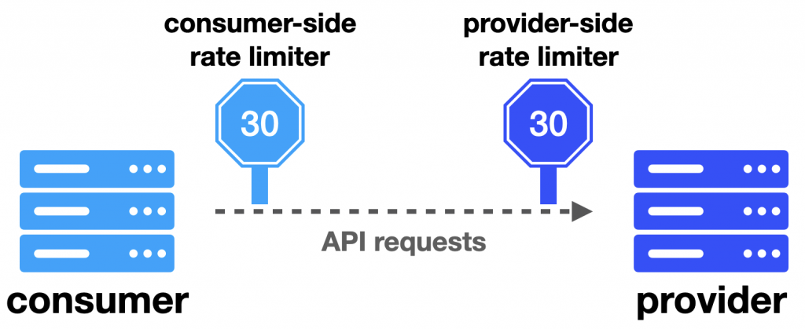
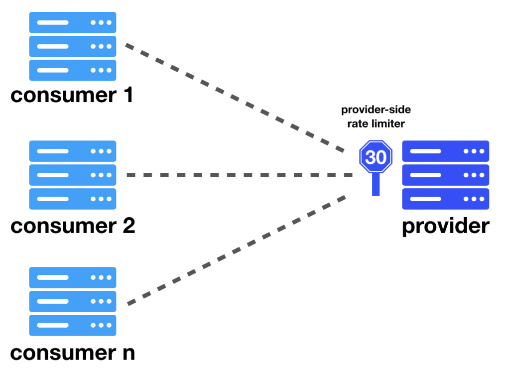
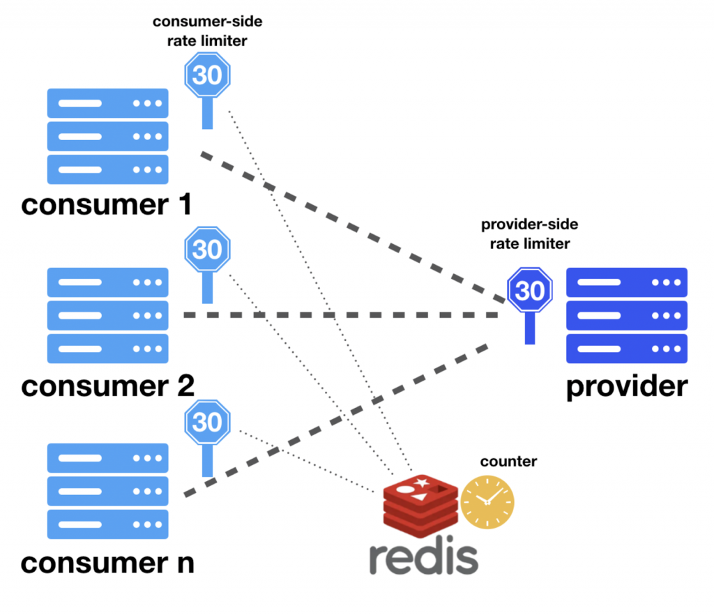
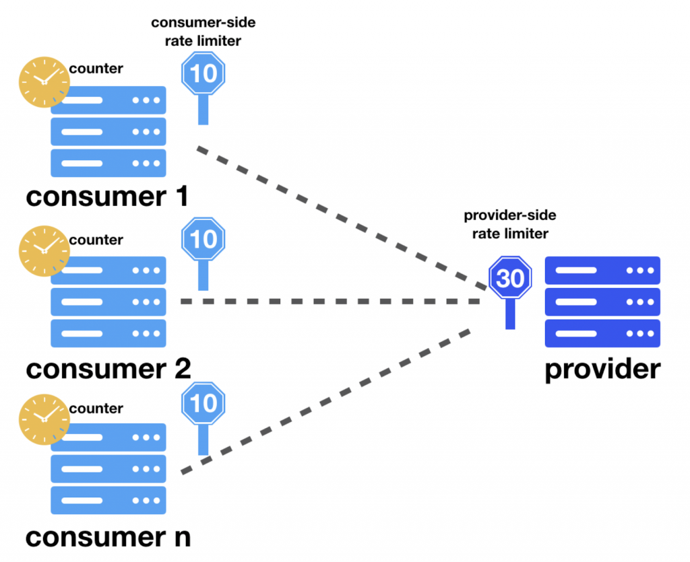
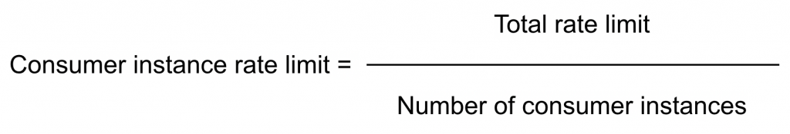
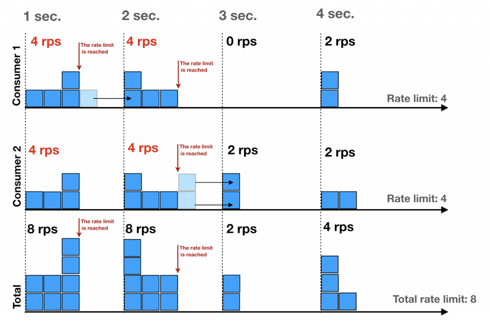
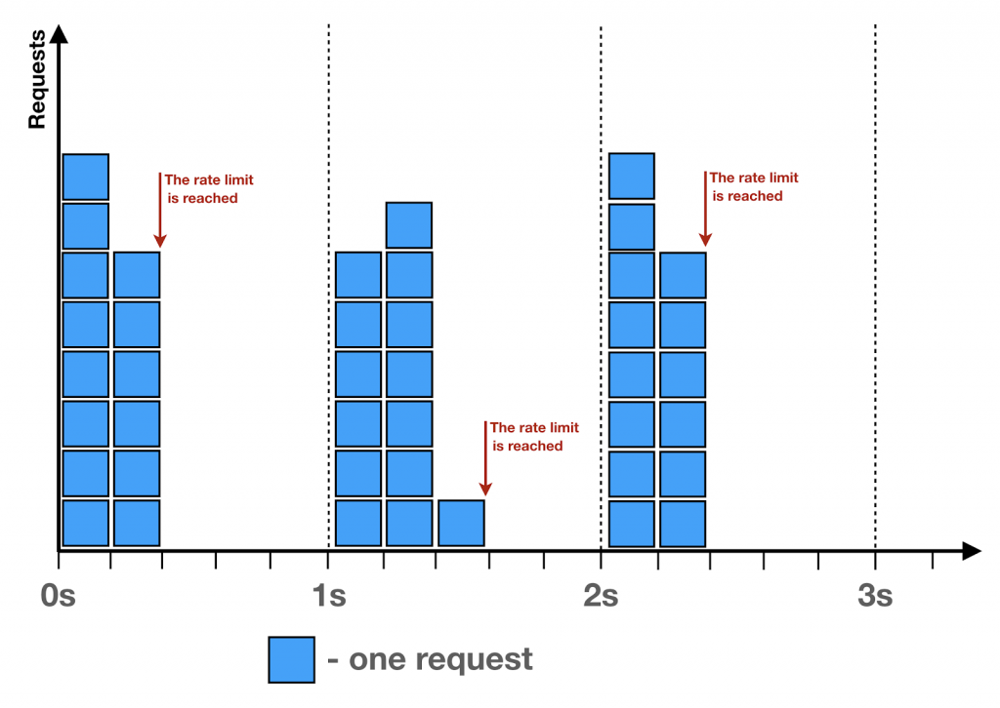

# 고 처리량 분산 비율 제한기

링크: https://engineering.linecorp.com/ko/blog/high-throughput-distributed-rate-limiter?utm_source=chatgpt.com
상태: 시작 전
회사: Line

---

# 분산 시스템을 위한 클라이언트 측 비율 제한기

일반적으로 프로덕션 등급의 시스템은 서로 의존하는 여러 컴포넌트로 구성된다.

최근 마이크로서비스 아키텍처가 대중화되면서 컴포넌트와 그 사이의 연결 수가 증가했다.

이때 각 컴포넌트를 과부하로부터 보호하고 전체 시스템의 서비스 품질을 보장하기 위해 **'비율 제한기(rate limiter)'**를 사용할 수 있다.

이 글은 고 처리량 분산 시스템을 위한 **클라이언트 측 비율 제한기**에 대해 다룬다.

## 개념과 용어 정리

복잡한 시스템에서 컴포넌트는 관점에 따라 클라이언트와 서버 역할을 모두 수행할 수 있어 용어의 혼동이 발생할 수 있다. 따라서 다음과 같이 용어를 정의한다.

- **제공자(Provider)**: API 소비자의 요청을 수락하는 시스템이다.
- **소비자(Consumer)**: API 제공자에게 요청하는 시스템이다.
- **제공자 측 비율 제한기**: 제공자 측에서 수신 요청의 비율을 제한한다.
- **소비자 측 비율 제한기**: 소비자 측에서 발신 요청의 비율을 제한한다.
- **비율 한도(Rate limit)**: 특정 기간 동안 허용하는 요청의 수다.

소비자 측과 제공자 측 비율 제한기는 개념은 유사하나, **비율 한도에 도달했을 때의 처리 방식**에서 가장 큰 차이를 보인다.

제공자 측은 단순히 요청을 거절하는 경우가 많지만, 소비자 측은 아래와 같이 더 다양한 방법을 사용한다.

1. **재요청 가능 시점까지 대기**: 비동기 처리 방식의 애플리케이션에 적합하다.
2. **일정 시간 대기 후 타임아웃 처리**: 사용자의 직접적인 요청을 처리하는 시스템에 적합하다.
3. **요청 취소**: 대기할 수 없거나 요청 처리가 중요하지 않을 때 사용한다.

---

## 고 처리량 분산 시스템을 위한 비율 제한기

최신 마이크로서비스는 여러 독립된 인스턴스로 배치되어 안정성과 수평적 확장에 이점이 있다.

서비스의 모든 인스턴스가 동일한 API 제공자를 사용하므로, 제공자의 전체 비율 한도를 공유해야 한다.

이를 위해 소비자 인스턴스 간의 조정이 필수적이다.

### 중앙 저장소 비율 제한기

가장 보편적인 방법은 Redis와 같은 **중앙 저장소를 이용하는 것**이다.

API 제공자당 하나의 카운터를 중앙 저장소에 두고, 요청마다 카운터를 증가시키며 1초마다 초기화한다.

카운터의 값은 현재 초 내에서 요청된 횟수를 나타내며, 비율 한도에 도달했는지 여부를 결정하는데 사용할 수 있다.

이 방식은 간단하고 효율적이지만, 다음과 같은 명확한 한계점을 가진다.

- **확장성 문제**: 모든 요청이 단일 노드에 저장된 카운터에 집중되므로, 트래픽이 증가하면 중앙 저장소가 시스템의 **병목**이 된다.
- **단일 장애 지점(SPOF)**: 중앙 저장소에 장애가 발생하면 전체 API 소비자가 차단된다.
- **지연 시간 증가**: 모든 API 요청마다 Redis와의 네트워크 통신이 필요하므로 총 지연 시간이 필연적으로 증가한다.

2020년 LINE 신년 캠페인에서는 초당 30만 건 이상의 트래픽을 처리해야 했기에 중앙 저장소 방식은 부적합했다.

### 분산형 인메모리 비율 제한기

대안은 **분산형 인메모리 비율 제한기**이다.

이는 제공자의 전체 비율 한도를 각 소비자 인스턴스에 분할하여 할당하는 방식이다.

각 소비자 인스턴스는 아래와 같이 자신에게 할당된 비율 한도를 계산한다.

하지만 실제 운영 환경에서는 애플리케이션이 실행되는 도중 변수값들이 변할 수 있다.

- 서버 에러나 서버 확장 작업 때문에 소비자 인스턴스의 수
- 제공자 측에서 가용성 문제가 발생하면 총 비율 한도

이러한 변화에 대응하기 위해 **'설정 서버(Configuration Server)'**를 도입했다.

소비자 인스턴스는 시작할 때 Control Dogma의 데이터로 초기화되며, 설정 서버에서 변경 사항을 통지하면 업데이트된다.

API 소비자 인스터스에겐 각각 비율 한도가 주어지며, 제공자에게 보내는 모든 요청의 합계가 할당된 비율 한도를 초과해서는 안 된다.

실제 시계(wall-clock)의 초가 바뀔 때마다 각 인스턴스의 요청 카운터를 리셋하여 시간 창(time window)을 일치시킨다.

이 시스템이 정확히 작동하려면 모든 소비자 인스턴스의 시계가 **네트워크 시간 프로토콜(NTP)을 통해 동기화**되어야 한다.

### 각 방식 비교

| 구분 | 중앙 저장소 방식 | 분산 인-메모리 방식 |
| :--- | :--- | :--- |
| **장점** | ✅ 요청 분산이 불필요하다. ✅ 비율 한도를 최대한 사용할 수 있다. | ✅ **높은 처리량을 제공할 수 있다.** ✅ **지연 시간이 증가하지 않는다.** |
| **단점** | ❌ DB 요청으로 지연 시간이 증가한다. ❌ 확장하기 어렵다. ❌ 단일 장애 지점이 발생한다. | ❌ 트래픽이 균등하게 분산되지 않으면 한도 활용률이 떨어진다. ❌ 시스템 시계 동기화가 필요하다. ❌ 추가 설정 시스템이 필요하다. |

---

## 논블로킹(Non-Blocking) 구현

2020년 LINE 신년 캠페인 시스템은 Armeria와 RxJava2를 사용해 완전한 **논블로킹 애플리케이션**으로 개발했다. 블로킹 방식은 I/O 작업 시 스레드를 점유하여 자원 낭비를 유발할 수 있기 때문이다.

### 논블로킹 비율 제한기 사용법

논블로킹 비율 제한기는 요청 발행 방식에 따라 두 가지로 활용될 수 있다.

1. **즉각적인 반응이 필요한 경우**: HTTP 요청 처리와 같이 타임아웃이 중요한 경우, 변수를 설정하여 대기 시간을 제한한다.
    - 사용자가 기다리니 짧게 기다렸다가 못 받으면 바로 실패/대체 경로
2. **즉각적인 반응이 필요하지 않은 경우**: Apache Kafka 기반의 스트림 처리처럼 비동기 작업의 경우, 응답을 즉시 줄 필요가 없으므로 비율 제한기를 충분히 활용하여 안정적으로 내부 API를 호출할 수 있다.
    - 사용자는 안 기다리니 충분히 기다리면서 속도를 평탄화해서 내부 API를 안전하게 호출

---

## 향후 개선 사항

이 구현에는 두 가지 잠재적인 개선점이 존재한다.

1. **시간 내 요청 분포 불균형**: 대부분의 요청이 매초 시작 시점에 집중되어 순간적인 피크를 유발할 수 있다.
    - 비율 한도를 준수하고는 있지만 분포가 균일하진 않다.
    - 이런 현상은 비율 한도가 충분히 작을 땐 문제되지 않는다.
    - 하지만 비율 한도가 높게 설정되어 있을 땐 초기에 발생한 높은 피크가 API 제공자에게 상당한 부하를 초래할 수 있다

   이 문제는 이전 시간대의 비율 분배 데이터를 이용해 분배를 개선할 수 있는 짧은 지연을 도입하는 것과 같은 방법으로 해결했다.

1. **인스턴스 간 요청 분포 불균형**: 부하가 특정 인스턴스에 쏠릴 경우, 해당 인스턴스는 할당량을 금방 소진하고 다른 인스턴스는 할당량을 낭비하게 된다. 각 인스턴스의 부하를 실시간으로 관찰하며 비율 한도를 동적으로 재분배하는 별도의 조정 시스템을 통해 이 문제를 해결할 수 있다.

### 마치며

2020년 LINE 신년 캠페인을 위해 개발된 고 처리량 비율 제한기는 Kafka를 이용한 비동기 처리와 함께 성공적으로 적용되었다. 이를 통해 내부 서비스의 과부하를 막고 모든 사용자에게 높은 가용성을 제공할 수 있었다. 96개의 소비자 인스턴스로 진행한 부하 테스트에서 **초당 10개부터 최대 200만 개의 요청까지 완벽하게 처리**하며 운영 안정성과 확장성을 증명했다.

## 느낀점

처리율 제한을 서버와 미들웨이에서만 해야한다고 생각했는데 클라이언트에서 보내는 요청도 처리율을 관리해야 한다는 사실을 알게 되었다.

알아본 클라이언트 관점 처리율 제한 장치 위치이다.

- **모바일/데스크톱 앱**: HTTP 클라이언트 **인터셉터(미들웨어)** 에 넣는다.
    - **OkHttp Interceptor (Android), URLProtocol (iOS)** 와 같은 미들웨어는 모든 네트워크 요청이 실제로 서버로 전송되기 전에 거치는 **'관문'** 역할을 한다.
- **웹 프론트엔드**: **Axios/Fetch 인터셉터** 또는 **Service Worker** 레이어.
    - **Axios/Fetch 인터셉터**는 모바일 앱의 경우와 마찬가지로, 모든 API 요청을 한 곳에서 관리할 수 있게 해주는 가장 일반적인 방법이다.
    - ***서비스 워커(Service Worker)***는 웹 애플리케이션의 메인 스레드와는 별도로 백그라운드에서 동작하기 때문에, **탭이 여러 개 열려 있는 상황에서도 모든 탭의 요청을 통합하여 전체 브라우저의 총량을 제어**할 수 있는 강력한 장점이 있다.
- **gRPC/내부 SDK**: **ClientInterceptor** 레벨.
    - 만약 조직 내에서 공통으로 사용하는 내부 SDK를 만든다면, 이 인터셉터 레벨에 비율 제한기를 내장하여 제공하는 것이 가장 좋다. SDK를 사용하는 모든 서비스가 별도의 구현 없이 일관된 정책을 따를 수 있게 된다.
- **비동기 파이프라인(예: Kafka 소비자)**: `poll()` 스레드에서 오래 막지 말고, **워커 큐**에서 리미터를 기다리게 한다. 필요하면 `consumer.pause()` 등으로 유입량도 조절.
    - `poll()`은 메시지를 가져와서 메모리 큐(워커 큐)에 빠르게 넣기만 하고, 실제 메시지 처리는 별도의 워커 스레드들이 담당하게 한다. 이 **워커 스레드에서 비율 제한기를 만나 대기**하도록 구현하는 것이 안전하고 올바른 아키텍처이다.
    - 만약 워커 큐에 처리되지 않은 메시지가 너무 많이 쌓인다면, `consumer.pause()`를 호출하여 일시적으로 메시지를 가져오는 것을 멈추도록 브로커에 신호를 보낼 수 있다.
