# 5장. 안정 해시 설계

수평적 규모 확장성을 달성하기 위해서는 요청 또는 데이터를 서버에 균등하게 나누는 것이 중요

안정 해시는 이 목표를 달성하기 위해 보편적으로 사용하는 기술

# 기존 방식 문제점

## 해시 키 재배치 문제

보편적인 부하를 균등하게 나누는 방식

```cpp
serverIndex = hash(key)%N ( N은 서버의 개수)
```

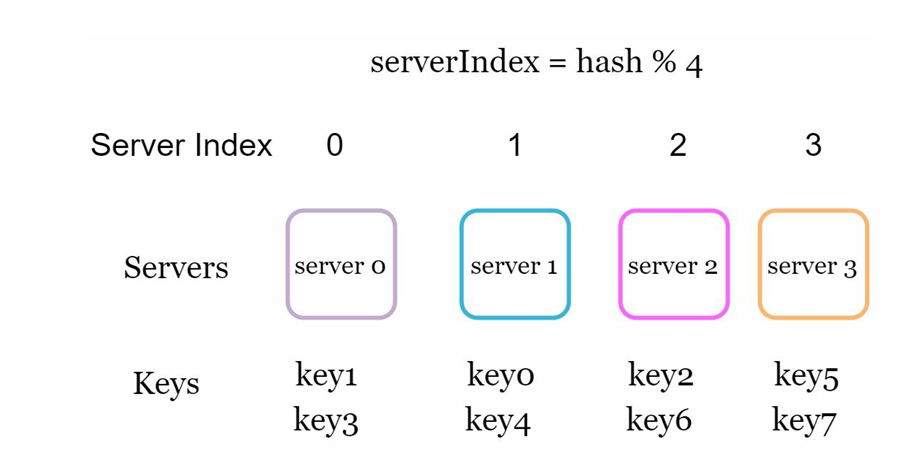

이 방법은 서버 풀의 크기가 고정되어 있을 때, 데이터 분포가 균등할 때는 잘 작동

→ 서버가 추가되거나 기존 서버가 삭제되면 문제가 생김

→ 나머지 연산을 적용하여 계산한 서버 인덱스 값 달라짐

→ 특정 서버가 죽으면 대부분 캐시 클라이언트가 데이터가 없는 엉뚱한 서버에 접속하게 됨

→ 대규모 미스 발생

# 안정 해시

테이블 크기가 조정될 때 평균적으로 k/n개의 키만 재배치하는 해시 기술

(k: 키의 개수, n: 슬롯의 개수)

## 해시 공간과 해시 링

해시 함수로 SHA-1 사용

SHA-1의 해시 공간 범위는 0부터 2^160 -1 까지

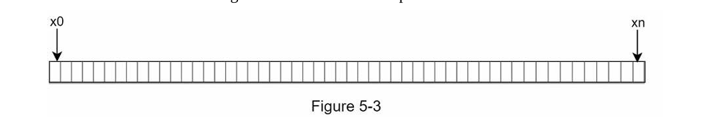

이 해시 공간의 양쪽을 구부려 접으면 밑의 그림과 같은 해시 링이 만들어진다.

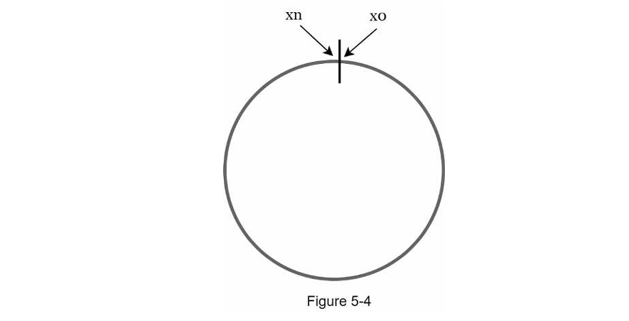

## 해시 서버

해시 함수 f를 사용하면 서버 IP나 이름을 이 링 위의 어떤 위치에 대응시킬 수 있다.

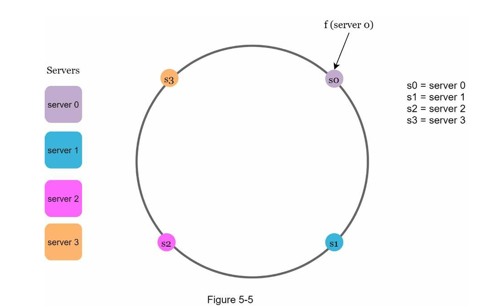

## 해시 키

캐시할 키 key0, key1, key2, key3 또한 해시 링 위에 어느 지점에 배치할 수 있다.

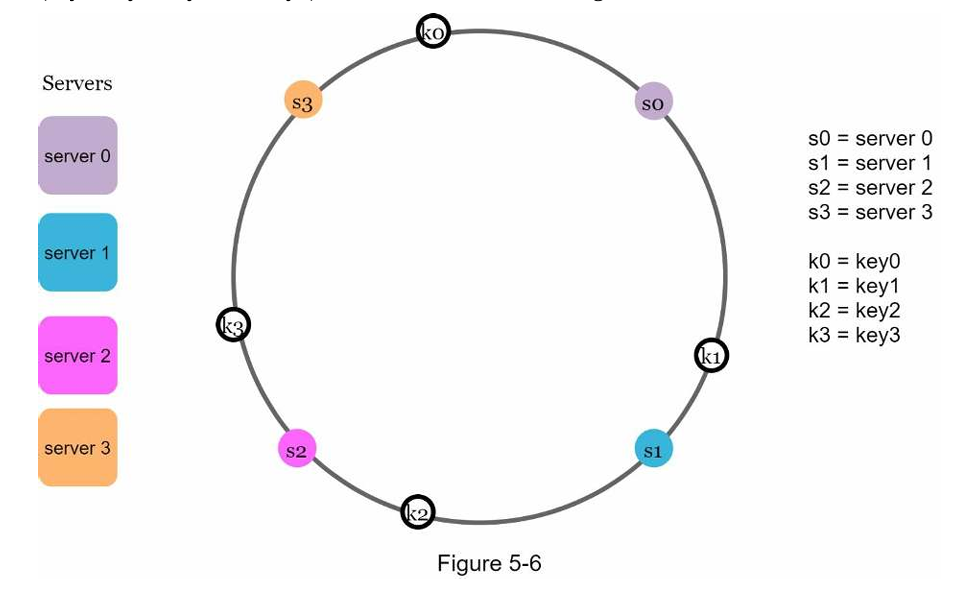

## 서버 조회

어떤 키가 저장되는 서버는, 해당 키의 위치로부터 시계 방향으로 링을 탐색해 나가면서 만나는 첫 번쨰 서버다.

key0은 서버 0에 저장되고, key1은 서버 1에 저장되며, key2는 서버2, key3은 서버 3에 저장된다.

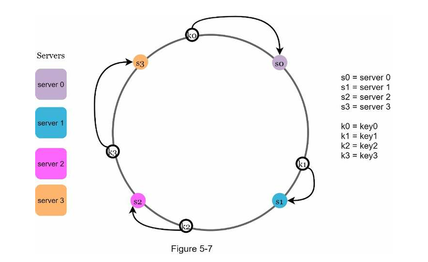

## 서버 추가

서버를 추가하더라도 키 가운데 일부만 재배치하면 된다.

그림 5-8을 보면 새로운 서버 4가 추가뒨 뒤에 key0만 재배치됨을 알 수 있다.

k1,k2,k3은 같은 서버에 남는다.

- key0의 위치에서 시계 방향으로 순회했을 때 처음으로 만나게 되는 서버가 서버 4이기 때문이다.
- 다른 키들은 재배치되지 않는다.

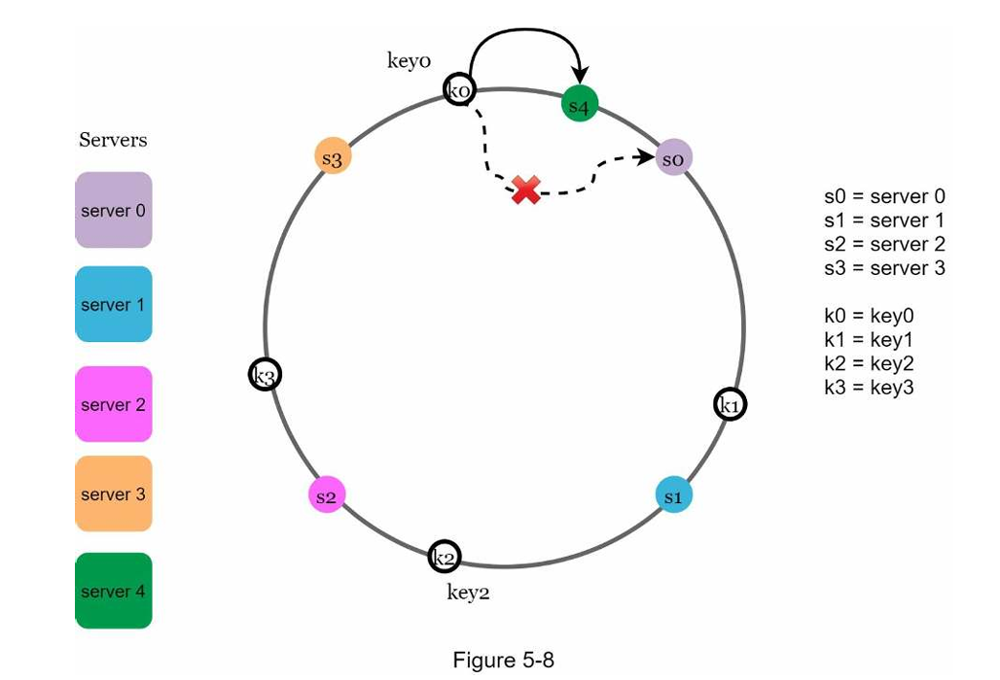

## 서버 제거

하나의 서버가 제거되면 키 가운데 일부만 재배치된다.

서버 1이 삭제되었을 때 key1만이 서버 2로 재배치됨을 알 수 있다.

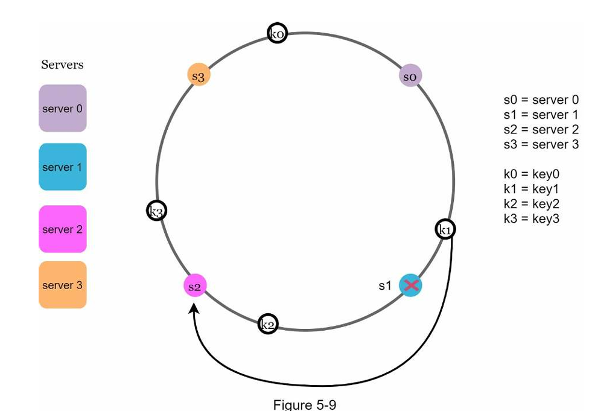

# 기본 구현법의 두 가지 문제

## 1. 파티션의 크기를 균등하게 유지하는 게 불가능

- 파티션: 인접한 서버 사이의 해시 공간
- 어떤 서버는 굉장히 작은 해시 공간을 할당 받고, 어떤 서버는 굉장히 큰 해시 공간을 할당 받는 상황이 가능

## 2. 키의 균등 분포를 달성하기 어렵다

- 밑의 그림처럼 서버 1과 서버 3은 아무 데이터도 갖지 않는 반면, 대부분의 키는 서버 2에 보관될 것이다.

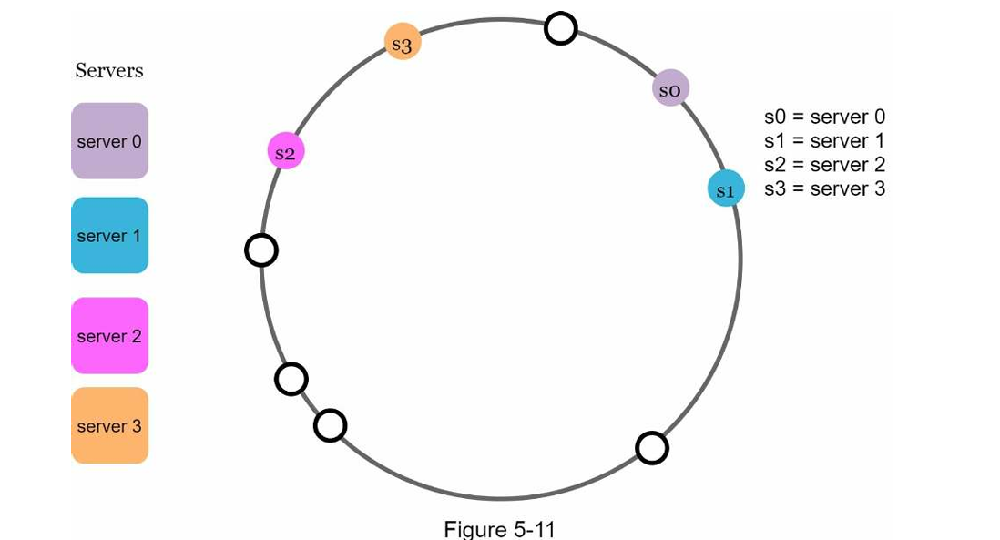

# 해결법

## 가상 노드

가상 노드는 실제 노드 또는 서버를 가리키는 노드로서 , 하나의 서버는 링 위에 여러 개의 가상 노드를 가질 수 있다.

예를 들어 서버 0을 링에 배치하기 위해 s0 하나만 쓰는 대신, s0_0, s0_1, s0_2의 세 개 가상 노드를 사용했다.

각 서버는 하나가 아닌 여러 개 파티션을 관리해야 한다.

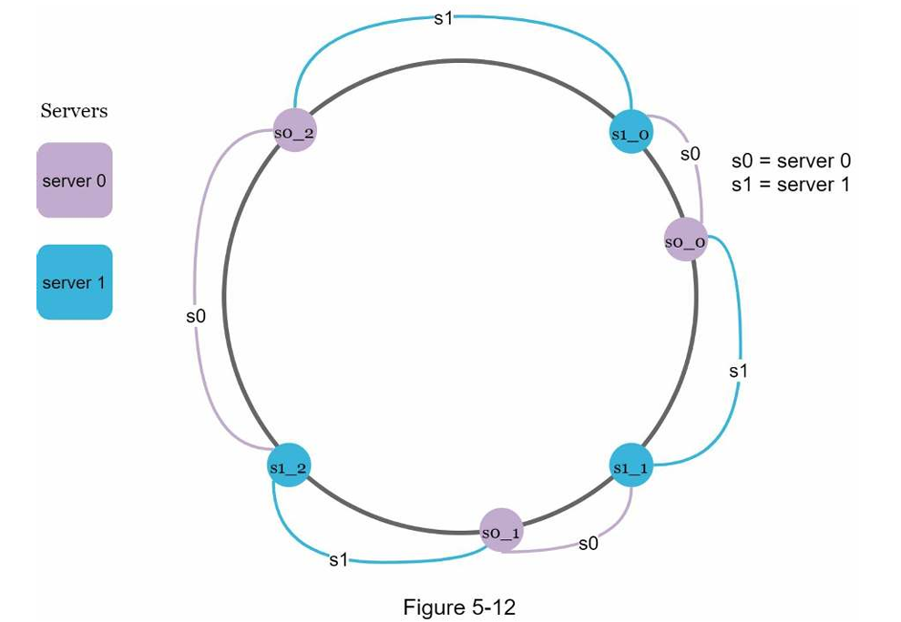

키의 위치로부터 시계방향으로 링을 탐색하다 만나는 최초의 가상 노드가 해당 키가 저장될 서버가 된다

가상 노드의 개수를 늘리면 키의 분포는 점점 더 균등해진다.

- 표준 편차가 작아져서 데이터가 고르게 분포되기 때문이다.
- 100~200개의 가상 노드를 사용했을 경우 표준 편차 값은 평균의 5% 사이다.

## 재배치할 키 결정

서버가 추가되거나 제거되면 데이터 일부는 재배치해야 한다.

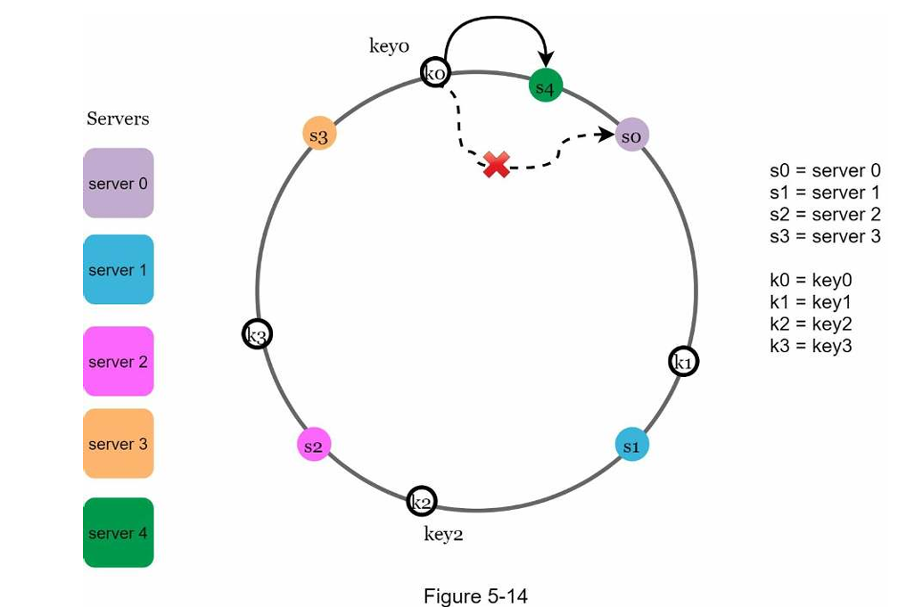

위의 그림에서는 서버 4가 추가되었다면 영향 받은 범위는 s4로부터 반시계 방향에 있는 첫 번째 서버 s3까지다.

즉 s3부터 s4사이에 있는 키들을 s4로 재배치하여야 한다.