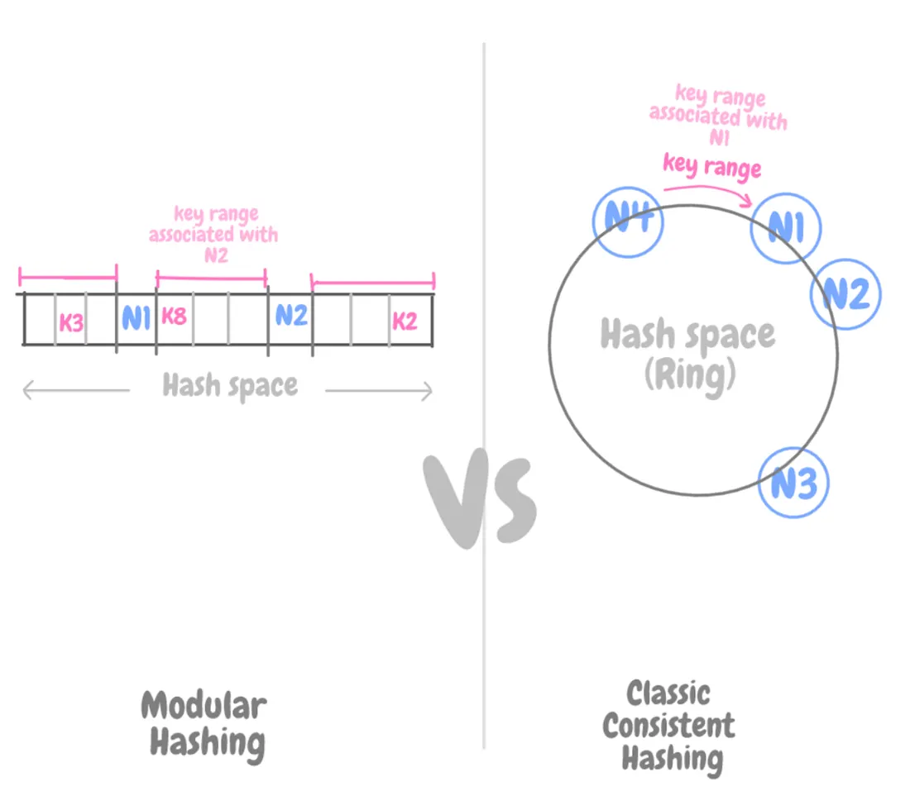
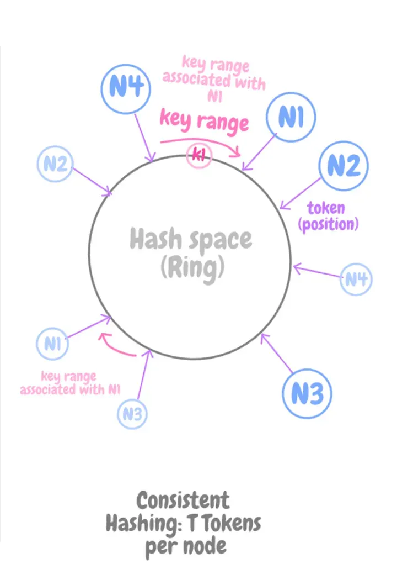
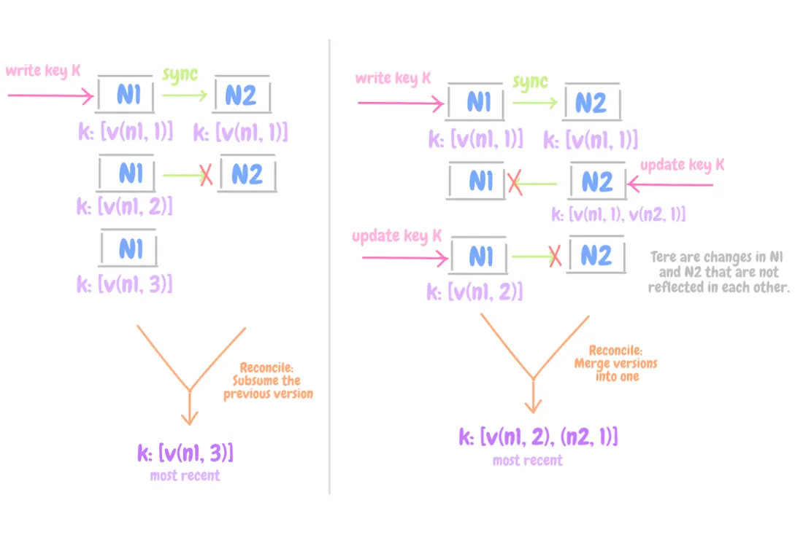

# 3주차 발표 자료

# 모듈러 해싱의 문제점과 일관된 해싱

고전적인 일관성 있는 해싱 알고리즘은 해시 함수가 저장 장치 수에 연결됨

→ 확장 및 축소 시 모든 키를 재분배해야함

```cpp
#모듈러 해싱
해시 = 키 % N 노드
```

but 일관된 해싱을 사용하면 해싱 함수가 스토리지 노드 수에 관계없이 작동

→ 노드를 추가하거나 제거할 때 데이터를 동적으로 분할 → 점진적으로 확장

저장 노드는 이 해시 공간 내에서 임의의 위치인 링에 할당된다.

각 데이터 항목은 데이터 항목의 키를 해싱 →  링에서의 위치를 구함→ 링을 시계 방향으로 걷어가며 항목의 위치보다 큰 위치를 가진 첫 번 째 노드를 찾음 → 노드에 할당

- 각 노드는 자신과 이전 노드 사이의 링 영역에 대한 책임을 지게 됨
- 노드를 추가 제거할 때
    - 모듈러 해싱: 모든 키 재분배
    - 일관된 해싱: 해당 영역에 속하는 키만 재분배



# 일관된 해싱이 해결해야 할 과제 (데이터와 부하의 균일 문제)

링에서 노드 위치가 무작위로 할당되어 데이터와 부하가 균일하지 않게 분산되는 것

- 노드가 추가되거나 제거될 때, 개별 노드에서 키 집합을 검색 후 데이터를 복사해야 함
    - 비효율적이고 느림

## 해결 방법 ( 노드를  T 토큰에 매핑)



각 노드를 링의 T 위치, 즉 “토큰”에 매핑

새로운 노드가 추가되면, 링 위에 무작위로 분산된 T개의 토큰 위치를 부여받는다.

- 예를 들어 노드 A에 대해

  → 해시 함수를 여러 번 돌려서 3개~100개의 서로 다른 위치를 선택한다.

  → 각각의 A의 토큰이라고 부른다.

  이렇게 하면 노드 하나가 링 위에 여러 지점을 차지하므로, 데이터 분포가 더 고르게 되고 부하도 균등하게 나뉜다.


# 유효성

## 복제

고가용성을 달성하려면 여러 노드에 데이터를 복제하는 것이 중요하다.

각 데이터 항목은 N개의 노드에 복제된다.

쓰기 요청을 조정하는 노드는 링에서 시계 방향으로 N-1개의 토큰에 걸쳐 해당 범위 내에 있는 데이터 항목을 복제하는 역할을 한다.

첫 번째 후속 위치는 무작위성을 위해 다른 해시 함수에 의해 결정될 수 있으며, 더 높은 가용성을 위해 여러 데이터 센터에 걸쳐 결정될 수도 있다.

→ 단순히 시계방항 바로 다음 노드 만 고르면, 모든 데이터가 비슷한 패턴으로 복제될 수 있다.

### 정의

- N: 각 데이터 항목에 대한 복제본 수 (일반적인 값: 3)
- R: 읽기 요청에 응답하거나 확인하는 복제본 수
- W: 쓰기 요청에 응답하거나 확인하는 복제본 수
- S: 시스템의 노드 수
- T: 링의 물리적 노드에 대한 토큰(위치) 수
- 키 범위는 토큰과 연관된 링의 키 집합(토큰은 노드가 소유)

## 항상 쓰기 가능

네트워크 장애와 데이터 충돌이 흔히 발생하는 분산 시스템 환경 → 높은 일관성 & 데이터 가용성 동시에 달성할 수 없음

---

- CAP 정리

  CAP 정리 (네트워크 분할이 발생했을 때, C와 A중 하나는 반드시 포기해야 한다)

    - C (Consistency) : 일관성, 모든 노드가 같은 데이터를 보여줌
    - A (Availability) : 가용성, 요청이 오면 항상 응답함
    - P (Partition tolerance) : 네트워크가 분리되어도 일부 노드가 계속 작동

  네트워크 분할은 분산 시스템에서 피할 수 없으므로 실제 시스템은 P 속성은 반드시 선택해야 한다.

  CP: 노드 간 통신이 실패하면 일부 데이터에 접근하지 못할 수 있다.

  AP: 모든 노드가 항상 응답할 수 있지만, 다른 노드와 데이터 불일치가 발생할 수 있다.


---

- CP 시스템 vs AP 시스템

  ## **CP 시스템 선택할 때 (Consistency Priority)**

  > 정확하지 않으면, 응답하지 않아도 된다.
  >
  >
  > 즉, **정확성 > 가용성**인 시스템
  >

  ### 특징

    - 데이터를 “하나의 진실된 상태(Single Source of Truth)”로 유지해야 함.
    - 노드 간 데이터 불일치가 **절대** 허용되지 않음.
    - 네트워크 분리나 노드 장애 시, 시스템은 쓰기(혹은 전체 동작)를 멈춤.

  ### 예시

    1. **은행 / 결제 시스템**
        - 잔액이 정확하지 않으면 거래 중단.
        - “나중에 맞출게요”는 허용 불가.
    2. **좌석 예약 / 재고 관리**
        - 같은 좌석을 두 명에게 팔면 안 됨.
        - 네트워크 장애 시 “예약 불가”라도 정확성 우선.
    3. **트랜잭션 기반 시스템 (RDB, Zookeeper, etcd)**
        - 분산 락, 설정 저장소, 분산 합의(Consensus) 등
        - 데이터 일관성이 깨지면 전체 시스템 로직이 붕괴.

  ### 선택 기준

    - 데이터가 **중앙화된 진실(ground truth)** 여야 한다.
    - “잠깐 틀려도 괜찮다”는 말이 절대 안 통한다.
    - **실시간 동기화가 반드시 필요**하다.

  ## **AP 시스템 선택할 때 (Availability Priority)**

  > 정확하지 않아도 좋으니, 응답은 계속 나가야 한다.
  >
  >
  > 즉, **가용성 > 일관성**인 시스템++
  >

  ### 특징

    - 일부 노드가 분리되어도 **나머지가 계속 응답함**.
    - 일시적으로 복제본 간 **불일치** 허용.
    - 나중에 백그라운드 복제로 “최종 일관성(Eventual Consistency)” 달성.

  ### 예시

    1. **쇼핑 카트 (Amazon Dynamo의 실제 예)**
        - 네트워크 장애 시에도 상품 담기 가능.
        - 나중에 병합(apple + banana)으로 해결 가능.
    2. **소셜 미디어 피드**
        - 잠깐 타임라인 순서가 다르거나, 좋아요 수가 일시적으로 달라도 괜찮음.
    3. **캐시, 로그 수집 시스템 (Redis Cluster, Cassandra, Kafka)**
        - 장애 중 일부 데이터가 늦게 동기화돼도 시스템 전체는 응답 유지.

  ### 선택 기준

    - **일시적 불일치 허용 가능**
    - **응답이 중단되면 안 됨** (서비스 지속성 우선)
    - **병합 가능한 데이터 모델**

---

- CP 시스템 vs AP 시스템 예시

  ## 예시 1 — 은행 계좌 (CP 시스템이 필요한 경우)

  ### 상황

    - 같은 계좌를 두 사용자가 동시에 출금.
    - 노드 A에는 `balance = 1000`,

      노드 B에도 `balance = 1000`.


    ### AP 접근 (읽기 시 병합)
    
    - A에서 -700, B에서 -500 요청을 둘 다 허용 (불일치 허용).
    - 네트워크가 분리되어 있으니까 각자 처리하고, 나중에 병합 시:
        
        ```
        A: 300
        B: 500
        병합 후? 🤯
        
        ```
        
    
    어느 게 맞는지 알 수 없음.
    
    사용자 두 명 다 성공 메시지를 받았지만, 실제론 -1200원이 빠졌어요.
    
    이건 나중에 병합할 수 있는 문제가 아니라 **데이터 무결성 붕괴**예요.
    
    > ✅ 결론:
    > 
    > 
    > 금융, 결제, 재고, 예약 시스템처럼 **“지금 정확해야 하는 영역”** 은
    > 
    > 불일치 자체를 허용하면 안 됩니다 → CP 시스템 선택.
    > 
    
    ## 예시 2 — 쇼핑카트 (AP 시스템이 괜찮은 경우)
    
    - 고객이 상품을 담는 중 (A 노드에서 Apple, B 노드에서 Banana 추가)
    - 네트워크 분리 발생
        
        → 두 노드 모두 업데이트 허용 (불일치 허용)
        
        → 나중에 병합 시 `[Apple, Banana]`로 합침 ✅
        
    
    즉, **병합 가능한 도메인**이라면
    
    “나중에 읽을 때 합치면 되니까 불일치 허용해도 OK”
    
    → AP 설계로 충분합니다.


---

기존 알고리즘은 장애 시나리오에서 데이터 가용성을 균형 있게 조정하므로 데이터가 정확하다는 확신이 들 때까지 데이터를 사용할 수 없다.

- 전통적인 `CP 시스템(일관성 우선)`
- RDBS같은 시스템은 데이터의 정확성이 확인될 때까지 응답을 지연시킴

그 대신, 답변의 정확성에 대한 불확실성을 처리하여 가용성을 높이고, 변경사항을 백그라운드의 복제본에 전파하고, 동시에 연결이 끊긴 작업을 허용할 수 있다.

- Dynamo나 Cassandra 같은 `AP 시스템(가용성 우선)`
- 장애 발생 or 네트워크가 분리되어도 시스템은 일단은 응답을 보냄 (데이터 100% 최신 아닐 수 있음)
- 그리고 나중에 백그라운드에서 다른 복제본들과 동기화(Replication)를 시도

이러한 접근 방식의 문제점은 감지하고 해결해야 할 상충되는 변화로 이어질 수 있다는 것이다.

- 충돌(conflict) 문제
- 사용자 1,2가 동시에 같은 값을 변경하면 둘 다 정상적으로 처리됐는데, 값이 서로 다른 상태로 남아 있는 것

이러한 갈등 해결 과정은 두 가지 문제를 야기한다.

- 언제 해결해야 하는가?
- 누가 해결해야 하는가?

# 일관성

## 충돌 해결: 언제 해결해야 하는가?

### 1. 쓰기 중에 충돌을 해결한다- 전통적인 데이터베이스 방식 (CP 시스템)

> 데이터를 쓸 때, 이미 같은 키에 대한 다른 버전이 존재하면 바로 그 시점에서 충돌을 해결해야 한다
>

---

- 예시
    - 키 `"user123"`에 대해

      노드 A: `{balance: 1000}`

      노드 B: `{balance: 900}`

    - 새 요청이 들어옴 → `{balance: 1200}`

  이때 시스템은:

    1. A, B 둘 다 접근해서 데이터를 읽음
    2. 값이 다르니까 충돌을 감지함
    3. 지금 바로 “어떤 값을 최종으로 저장할지” 결정해야 함

       (예: 최신 타임스탬프 값 선택)


---

- 장점
    - 읽기 시점에는 이미 정리되어 있으므로, 읽기기 단순함

      (항상 정상화된 하나의 데이터만 존재)

- 단점
    - 만약 W개의 노드(예: 3개 중 2개)에 접근할 수 없으면, 충돌 해결 자체를 못 하니깐 쓰기 실패로 처리해야 함
    - 즉, 가용성(Availability)이 떨어짐

### 2. 읽기 중에 충돌을 해결한다 - Dynamo 스타일 (AP 시스템)

> 데이터를 쓸 때는 일단 그냥 받아들이고 저장한다. 충돌이 생길 수 있지만, 나중에 읽을 때 감지하고 해결한다.
>

즉, 쓰기할 때는 복제본이 다 일치하지 않아도 그냥 다 저장.

나중에 누군가 데이터를 읽을 때, “복제본 간의 차이”를 감지해서 그 때 병합한다.

---

- 예시
    - 네트워크 분리로 인해

      A는 `{balance: 900}`

      B는 `{balance: 1200}` 저장됨.

      → 서로 복제 실패, 충돌 발생.


    하지만 Dynamo는 쓰기 거부 안 함.
    
    “일단 둘 다 저장해. 나중에 해결하자.”
    
    이후 클라이언트가 읽을 때,
    
    - 시스템이 두 버전의 데이터를 함께 반환
    - 애플리케이션이 병합 로직을 수행
        
        (예: 쇼핑 카트 병합 → `{items: [apple, banana]}`)


---

- 장점
    - 쓰기가 거부되지 않음(고가용성 유지)
    - 네트워크 일부 장애에도 계속 작동
- 단점
    - 읽기 복잡도가 높아짐 (복제본 여러 개 병합 필요)
    - “누가, 언제, 어떻게” 병합할지 정의해야 함

## 충돌 해결: 누가 해결해야 하는가?

### 1. 애플리케이션이 충돌을 해결하는 방식 (resolve-on-read, app-merge)

**어떻게 동작하나**

- 쓰기: 네트워크 분리/장애여도 각 복제본에 **그냥 기록**(가용성↑)
    - 버전 정보는 보통 **Vector Clock** 등으로 추적
- 읽기: 같은 키의 여러 버전을 모두 돌려받으면, 애플리케이션이 **도메인 규칙**(예: 카트는 합집합, 수량은 덧셈/감산, 중복 제거 등)으로 **결정적 병합**을 수행한 뒤 **새 버전으로 다시 저장한다.**

**장점**

- 도메인 의미를 보존한다. 쇼핑카트처럼 “추가/제거”가 **서로 양립 가능한 변화**라면 손실 없이 합칠 수 있다.
- 쓰기를 거의 거부하지 않으므로 **고가용성**을 확보한다. 오프라인/멀티리전에도 강하다.

**주의/단점**

- **애플리케이션 서버의 복잡도**가 증가(병합 로직, 재시도, 재기록).
- 읽기 시에만 수렴하므로 **버전이 누적**될 수 있고, 읽을 때 **추가 레이턴시/트래픽**이 생김
- 병합은 **결정적**이어야 하며, 같은 입력이면 언제나 같은 결과가 나와야 수렴
- 백그라운드로 **버전 정리**를 설계해야 함

**언제 적합한가**

- 병합 가능한 도메인
- “일시적 불일치 허용”이 가능한 UX/비즈니스(피드, 카트, 좋아요, 로그, 텔레메트리)
- 멀티리전/불안정 네트워크에서 **쓰기 성공률**이 더 중요한 서비스

### 2. 데이터 저장소가 충돌을  해결하는 방식 (resolve-on-write)

**핵심 아이디어**

- DB가 쓰기 순간에 **단일 정답**을 골라 저장
- 가장 흔한 건 **LWW(Last-Write-Wins)** 처럼 타임스탬프로 승자를 정하는 정책

**어떻게 동작하나**

- 쓰기: 충돌을 감지하면 DB가 곧장 **정책으로 정리**(예: 더 최신 타임스탬프 선택)
- 일부 시스템은 합의가 되지 않으면 **쓰기를 거부함**
- 읽기: 이미 정리되어 있으므로 **단일 버전**만 읽음(간단/빠름).

**장점**

- **읽기 경로가 단순**하고 빠름
- 애플리케이션 서버 코드가 가벼워짐
- 운영/관리가 쉽고 모니터링 포인트가 적다.

**주의/단점**

- LWW는 **데이터 손실**을 일으킬 수 있다(의미 있는 이전 값을 덮어씀).
- “비즈니스적으로 올바른 병합”을 못 한다(도메인 맥락 미반영).
- 강한 일관성을 노리면 W/R 쿼럼을 만족 못 할 때 **쓰기/읽기 거부**로 이어져 **가용성↓**.

**언제 적합한가**

- **“최근 상태가 진실”** 인 도메인(세션 토큰, 마지막 로그인 IP, 디바이스 최신 상태, 센서의 최신 측정치).
- **읽기 성능 단순성**이 최우선이고, 과거 버전 소실이 큰 문제가 아닌 경우.
- 데이터가 본질적으로 “덮어쓰기(latest overwrite)” 의미를 갖는 경우.

# AP 시스템 (DynamoDB, 카산드라 등)

## 충돌 해결: AP 시스템 예시



같은 key K가 여러 노드에 복제되어 있을 때 생기는 문제

- key: `K`
- `v(n1, 2)` : 노드 N1이 생성한(key K의) 두 번째 버전
- `v(n2, 1)` :  노드 N2가 생성한(key K의) 첫 번째 버전

### 왼쪽 그림: 순차적 업데이트 (충돌 없음)

**상황 설명**

1. 클라이언트가 key `K` 를 Node N1에 쓰기 시작

   → N1에 `(v(n1), 1)` 버전 저장됨

   → N1이 N2와 동기화(sync)되어 N2도 같은 버전 복제됨

2. 이후 업데이트가 N1에서만 순차적으로 일어남

   → `(v(n1), 2)` → `(v(n1), 3)`

   → 하지만 N2와 네트워크가 잠시 끊겨 있어 동기화가 안 됨

3. 네트워크가 복구되면 N2는 예전 버전, N1은 최신 버전이므로

   → N2의 버전은 **포함 관계**로 인식되어 덮어씌워진다.

   → 즉 단순히 **”가장 최근 버전으로 대체”**


**요약**

- 순차적(직렬적) 업데이트만 있었다.
- 충돌(conflict) 없이 “이전 버전이 최신 버전에 포함” 되어 끝남
- **Reconcile: Subsume previous version (이전 버전 흡수)**

### 오른쪽 그림: 동시 업데이트 (충돌 발생)

**상황 설명**

1. 처음에는 N1 → N2로 잘 복제됨 (`(v(n1),1)`).
2. 그런데 그 다음부터 **N1과 N2가 서로 통신이 끊긴 상태에서 각각 업데이트함.**
    - N1: `(v(n1),2)`
    - N2: `(v(n2),1)`
3. 이렇게 되면 서로가 모르는 서로 다른 변경분이 생김.

   → “동시성 충돌(conflicting concurrent updates)” 발생.

4. 이후 동기화가 재개되면,

   시스템은 두 버전이 **서로 포함 관계가 없음을 인식**하고

   → “병합이 필요하다(merge required)” 판단.

5. 따라서 `Reconcile: Merge versions into one`

   → 두 버전을 동시에 가져와 애플리케이션이 **병합 로직으로 통합**함.

   → 최종적으로 `[v(n1,2), v(n2,1)]` 형태의 병합 결과를 새 버전으로 저장.


**요약**

- N1과 N2가 동시에 다른 변경을 함.
- 포함(ancestor) 관계가 아니므로 단순히 한쪽으로 덮을 수 없음.
- 따라서 “병합(merge)”이 필요하고, Dynamo 같은 시스템은

  **여러 버전을 애플리케이션에게 돌려줘서 병합시키는 구조를** 가짐


### 정리

왼쪽은 “연속적 업데이트(충돌 없음)”이라 최신 버전이 이전 버전을 포함해서 간단히 정리되고, 오른쪽은 “동시 업데이트(충돌 발생)”라서 서로 다른 변경을 병합해야 한다.

Dynamo 같은 시스템은 이걸 Vector Clock으로 추적해서 포함 관계인지 충돌 관계인지를 판별하고, 충돌 시 여러 버전을 애플리케이션으로 보내 병합하게 한다.

### 만약 CP 시스템이었다면?

- CP 시스템이라면 오른쪽 상황에서 이렇게 됐을 것
    - N1과 N2가 서로 연결 안 되니깐, 둘 중 하나는 쓰기를 거부한다
    - 즉시 일관성을 지키려다가 가용성을 희생
- 그림 속 상황
    - 네트워크가 끊겨도 N1, N2 모두 쓰기 허용
    - 가용성은 유지되고 대신 나중에 읽을 때 일관성을 맞추는 방식으로 해결

## AP 시스템 동작 방식

### 읽기 경로 - R, 버전 컨텍스트, 충돌 전달

1. **조정자 선택**
    - 클라이언트는 아무 노드에나 요청
    - 그 노드가 해당 키의 선호 복제본 집합을 계산해 조정자 역할을 한다.
        - 선호 복제본 집합: Dynamo나 Cassandra 같은 분산 Key-Value 저장소에서 **”어떤 노드들이 이 키의 복제본을 가질지”**를 미리 정해둔 **우선순위 목록**
        - 일반적으로 그 노드 자신이 조정자가 됨
2. **N개 복제본이 읽기 파닝**
    - 조정자는 그 키를 담당하는 **N개 복제본**에게 동일 키를 질의함
3. **R개 응답 대기**
    - R개가 응답하면 결과를 취합해 클라이언트에 반환
    - 이때 응답들 사이에 **버전 불일치**가 있으면(동시 수정 등) **버전 컨텍스트(예: Vector Clock)** 와 같은 **충돌된 여러 값**을 돌려준다.
    - 조정자는 동시에 Read Repair을 걸어 뒤쳐진 복제본을 최신으로 맞춘다
        - Read Repair(읽기 수선): 데이터를 읽는 도중, 뒤쳐진 복제본을 최신값으로 고치는 자동 정비 기능
        - 읽기 = 데이터 반환 + 자동 복구
4. **앱 병합**
    - 애플리케이션 서버가 도메인 로직으로 병합하고, 병합 결과를 새 버전으로 다시 PUT(쓰기)한다.

> 읽기는 R개 응답만으로 끝내 가용성을 높이고, 충돌은 애플리케이션 서버에 그대로 전달해 나중에 병합한다.
>

### 쓰기 경로 - W, 컨텍스트, 슬로피 쿼럼

1. **컨텍스트 포함 PUT**
    - 클라이언트는 직전 읽기에서 받은 버전 컨텍스트(Vector Clock)를 함께 보낸다.
    - 버전 컨텍스트를 같이 보내는 이유
        - “새 값을 쓴다” ≠ “예전 값은 필요 없다”
        - 분산 시스템에서는 여러 노드가 동시에 같은 키를 수정할 수 없기 때문
        - 쓰기 연산 시 버전 컨텍스트를 보고
            - 기존 버전의 연속 업데이트면 덮어쓰기
            - 다른 브랜치에서 수정한 값이면 충돌 버전으로 함께 보관

        ```cpp
        PUT key=cart:user123
        value="apple, banana"
        context={N1:1, N2:0, N3:0}
        
        ```

2. **로컬 기록 + 복제**
    - 조정자는 자신에 먼저 기록하고, 동일 데이터를 N-1개 복제본에 전파한다.
3. **W개 응답 대기 → 성공**
    - W개 복제본에서 성공 응답을 받으면 쓰기가 성공한다.
    - 일부 복제본이 다운이면 슬로피 쿼럼(Sloppy Quorum)으로 대체 가능한 다른 건강한 노드에 임시 기록하고, 해당 노드에 힌트를 남겨 원래 복제본이 돌아오면 재전달하여 수렴시킨다.
        - 슬로피 쿼럼: 정확한 담당 노드 대신, 현재 접근 가능한 다른 노드에게 임시로 쓰기하는 전략

      > 슬로피 쿼럼은 장애 상황에서도 가용성을 유지하기 위해,
      원래 복제 대상이 아닌 다른 정상 노드에 임시로 데이터를 기록하고,
      원래 노드가 복구되면 힌트를 통해 데이터를 다시 전달하여
      결국 모든 복제본이 일관된 상태로 수렴하도록 만드는 메커니즘
>

> 쓰기는 W개 성공만 보장해 거부를 최소화(가용성↑)
버전 컨텍스트로 충돌을 정확히 감지
>

## AP 시스템 설계 체크리스트

### 성능

- **R 또는 W가 크면** 느린 복제본이 전체 지연을 지배

  대응책:

    - Speculative/Hedged Read( 느리면 다른 복제본에도 중복 질의)
    - 적응형 타임아웃 & 동적 스니칭 (느린 노드 덜 사용)
- 메모리 버퍼
    - 초저지연이 필요한 일부 워크로드는 RAM 버퍼에 먼저 쓰고 주기적으로 디스크에 플러시(R=1, W=1과 궁합)
    - 단점: 노드 크래시 시 RAM의 페딩된 쓰기 유실 위험
- 현실적인 내구성 경로
    - 많은 구현은 **커밋로그(WAL)에 동기 기록 → 메모리 구조 반영 → 배경 플러시** 로 내구성 확보
        - 배경 플러시: 플로시를 백그라운드 스레드가 주기적으로 자동 수행
        - 시스템이 알아서 일정 조건이 되면 백그라운드에서 플러시 진행

### 내구성 - 쓰기 빠르게 + 데이터 안 잃게

분산 시스템에서는 “쓰기 빠르게 + 데이터 안 읽게”를 동시에 잡는 게 핵심

- 코디네이터가 N-1 개 중 1개에 대해 동기 영속화를 요구하게 설계할 수 있음

  → 일부 노드는 RAM(메모리 버퍼)에만 기록하고 빠르게 OK 응답

  → 최소 한 노드는 디스크까지 영속화 완료 후 OK 응답

  속도는 유지하면서, 최소한 하나는 절대 잃지 않는다.

- W를 늘리면 **내구성/ 최신성** ↑, 그러나 네트워크 이슈 시 **가용성 ↓**

  → 비즈니스 요구에 맞취 프로파일링하며 R/W 값을 잡는다.

- 멀티 리전 복제

  노드 한두 개가 아니라, 리전 전체가 날아가는 상황

    - 한 리전에 여러 가용 영역(AZ) 존재
    - 보통 2AZ+1AZ 형태로 노드를 분산 배치
        - 한 리전 안에서 두 개의 서로 다른 AZ +  다른 리전의 AZ

  비동기 교차 리전 복제

    - 리전 간 네트워크는 지연이 크기 때문에, 대부분 비동기로 복제

### 노드 멤버십 - 가십으로 탈중앙 상태 전파

분산 시스템은 “누가 어떤 데이터를 가지고 있는지” 알아야 한다.

보통 이런 정보는 **중앙 서버** 가 관리

→ 단일 장애점(SPOF)이 생김

→ Dynamo 계열 시스템은 **가십**이라는 분산 통신 방법으로, 중앙 없이 서로 상태를 주고받으며 시스템 전체 정보를 유지

**가십**

- 각 노드가 주기적으로 랜덤한 다른 노드 하나를 골라서 자기 상태 정보를 전송
- 받은 노드도 그걸 다른 노드에게 퍼뜨림
- 시간이 지나면, 시스템 전체가 모든 노드의 최신 상태를 공유하게 됨

**가십으로 퍼지는 정보**

1. 토큰 소유 현황 - 각 노드가 담당하는 데이터 범위(토큰, 파티션 키)
2. 노드 상태 - 살아 있는지, 응답 속도, 부하
3. 멤버십 변경 - 새 노드가 추가, 제거, 재밸런싱

### 장애 감지 & 처리 - 가용성과 데이터 보존이 목표

Dynamo 스타일 시스템은 ‘절대 멈추지 않는 분산 저장소’를 목표로 한다.

리더 노드가 존재하지 않기 때문에

- 누가 죽었는지 스스로 감지해야 함
- 죽은 동안에도 데이터를 잃지 않아야함
- 다시 살아나면 자동으로 일관성을 회복해야 함
1. 장애 감지 - Heartbeat + Phi Accrual Failure Detector

   각 노드는 주기적으로 이웃 노드에 하트비트(HeartBeat)를 보내 자신이 살아있는지 알림

   → 네트워크 환경에서는 지연이 일정하지 않음

   그래서 Dynamo는 Phi Accrual Failure Detector를 사용

    - 단순 타이머 대신, 이전 응답 지연 분포를 통계적으로 학습
    - “이번에는 평소보다 얼마나 늦었나”를 수치(φ)로 계산합니다.
    - φ 값이 임계치(보통 8~10 정도)를 넘으면 “의심→ 다운” 상태로 판단

   의심 판정이 나면 그 노드는 **R/W 요청 대상에서 제외**되고,

   대신 다른 건강한 노드로 **요청이 라우팅(sloppy quorum)** 됩니다.

   즉, 한 노드가 잠시 느려도 전체 서비스는 멈추지 않습니다.

2. 장애 중 쓰기 보존 - Hinted Handoff

   만약 어떤 노드가 완전히 다운되었다면, 그 노드가 담당하는 데이터를 어딘가에는 써야함

   → 다른 건강한 노드가 임시 저장(힌트) 한다.

   → 이 힌트에는 원래 주인 노드 정보가 함께 기록

   → 나중에 노드가 복구되면 데이터 전달

   → 임시로 가지고 있던는 로컬 저장소에서 해당 데이터 항목을 삭제할 수 있음

   장애 중에도 가용성을 유지 , 데이터 손실 없이 수렴

3. 읽기 중 자동 수선 - Read Repair

   장애로 인해 노드 간 데이터가 어긋날 수 있음

   그런데 사용자가 읽기 요청을 하면 그 차이를 감지할 수 있다.

   → 읽기 행위 자체가 시스템의 정합성을 회복시키는 역할

4. 백그라운드 정합화 - Anti-entropy

   만약 노드가 장시간 오프라인이었다면, 그 사이 수많은 데이터가 바뀌었을 수 있음

   → 모두 비교하려면 비효울적

   Anti-entropy

    - 각 노드는 자신이 맡은 파티션에 대해 Merkle Tree(해시 트리)를 계산해둠
    - 이 트리를 비교하면 “어느 구간이 달라졌는지”를 빠르게 찾을 수 있음
        - 차이나는 부분만 세밀하게 동기화
        - 네트워크 비용을 최소화하면서 완전한 일관성 복구가 가능

   이 기법은 특히 리전 간 동기화나 오래 분리되었던 노드 복귀 시에 효과적

5. 충돌 감지 - Vector Clock / ETag

   분산 환경에서는 “동시에 두 노드가 같은 데이터를 수정”하는 상황이 자주 발생

   단순히 “누가 늦게 왔는가”로 판단할 수 없는 문제

   Vector Clock

   누가 언제 이 데이터를 수정했는지를 나타내는 다차원 타임스탬프

    - 두 버전이 포함 관계가 아니면

      즉, 동시에 다른 경로에서 수정된 버전이면

        - 시스템은 두 버전을 모두 siblings 해서 보내야함
            - siblings: 같은 데이터에서 갈라져 나온 서로 다른 버전들
        - 애플리케이션 서버가 도메인에 따라 의미적으로 병합해야 함
            - 세션 정보나 캐시처럼 “최근 것만 남기면 되는 도메인”은 단순히
              **Last-Write-Wins(LWW)** 정책으로 처리해도 됨

# 해결해야 할 과제

## (1) **데이터 이동 비용 문제**

> 새 노드가 들어오면 기존 노드들이 자신이 맡고 있던 데이터 일부를 스캔해서 새 노드로 보내야 함.
>
>
> → 디스크 전체를 읽는 대규모 I/O 발생 → 고객 요청과 충돌 → 성능 저하.
>

### 해결 기법

### ① 가상 노드(Virtual Nodes, Vnodes)

- **핵심 아이디어**: 하나의 실제 노드를 여러 **작은 가상 조각(토큰)** 으로 쪼갠다.
- 데이터를 “큰 범위 단위”가 아니라 “작은 청크 단위”로만 이동시킴.
- 노드 추가 시 일부 vnode만 옮기면 되므로 이동량이 **전체의 일부(≈1/N)** 로 줄어듦.
- **효과**: 리밸런싱(데이터 이동) 부담 완화, 부하 균등화 자동화.

적용: Cassandra, ScyllaDB, Amazon DynamoDB

---

### ② 점진적 리밸런싱 (Gradual / Scheduled Rebalancing)

- 새 노드 추가 시 데이터를 **한 번에 이동하지 않고**,

  시스템이 한가한 시간대에 **조금씩 천천히** 옮김.

- 클러스터 전체의 read/write 요청 성능 저하를 최소화.
- **효과**: I/O 부하 완화, 서비스 중단 없이 데이터 재분배 가능.

---

### ③ 지연 마이그레이션(Lazy Migration)

- 새 노드가 들어왔을 때 **즉시 전체 데이터를 복사하지 않음.**
- 새 노드가 맡은 키에 실제 요청이 들어올 때,

  기존 복제본에서 데이터를 **조금씩 가져와 캐싱/동기화**.

- **효과**: 초기 부하 최소화, 점진적 데이터 수렴(Eventual Consistency).

---

### ④ 작은 파티션 단위 설계

- 전체 키 공간을 Q개의 **작은 파티션으로 세분화**.
- 파티션 단위로 이동하므로, 한 번에 옮길 데이터량이 줄어듦.
- **효과**: 리밸런싱 비용 감소, 부트스트랩 속도 개선.

---

> 핵심 요약:
>
>
> "데이터 이동을 **작게, 나눠서, 천천히, 필요할 때만**"
>
> 하는 게 해결의 본질입니다.
>

---

## (2) **Merkle Tree 재계산 문제**

> Dynamo는 노드 간 불일치를 탐지하기 위해 Merkle Tree를 사용하지만,
>
>
> 키 범위가 바뀌면 해당 범위의 트리를 **다시 계산해야 함** → CPU 부담 큼.
>

### 해결 기법

### ① 증분 복구(Incremental Repair)

- 전체 Merkle Tree를 재계산하지 않고,

  “이전에 변경된 데이터 부분만” 업데이트.

- Cassandra 2.2 이후에 도입됨 (`-incremental` 옵션).
- **효과**: CPU/디스크 I/O 대폭 절감, 실시간 복구 가능.

---

### ② Anti-Entropy 최적화 (Partial Tree / Range Tree)

- Merkle Tree를 **작은 서브 트리 단위로 나누어 관리.**
- 범위 일부가 바뀌면 해당 부분만 재생성.
- **효과**: 트리 전체 재계산 방지, 동기화 속도 향상.

---

### ③ 병렬/비동기 계산

- 노드 리소스를 효율적으로 쓰기 위해

  백그라운드 쓰레드로 Merkle Tree를 비동기 계산.

- **효과**: 클라이언트 요청 성능에 영향 최소화.

---

> 핵심 요약:
>
>
> “Merkle Tree 전체를 다시 만들지 말고,
>
> 바뀐 부분만 부분 갱신(Incrimental)”
>

---

## (3) **백업 및 스냅샷의 어려움**

> 무작위로 분포된 키 범위 때문에
>
>
> 전체 키스페이스 백업/스냅샷을 찍기 어렵다.
>
> 노드별로 데이터를 따로 모아야 해서 복원·보관이 복잡함.
>

### 해결 기법

### ① 파티션 단위 파일 저장

- 각 파티션 데이터를 **물리적으로 별도 파일**에 저장.

  (예: `partition-0001.db`, `partition-0002.db` …)

- 전체 백업 시 파티션 파일만 모으면 됨.
- **효과**: 전체 스냅샷 단순화, 복원/이관 용이.

Cassandra SSTable, Scylla의 shard 단위 파일 구조가 대표 사례.

---

### ② 스냅샷 + 증분 백업 (Snapshot + Incremental Backup)

- 스냅샷은 전체 데이터를 하드링크로 묶어 “정지 시점 저장”
- 이후에는 변경된 SSTable만 백업 (증분).
- **효과**: 백업 I/O 최소화, 복원 시 스냅샷 + 증분만 합치면 됨.

---

### ③ 고정 파티션 구조(Q개 파티션)

- “파티션 정의를 고정”하면 노드 변경 시에도

  **파티션 경계가 변하지 않음** → 백업 단위 유지 가능.

- **효과**: 노드 추가/제거가 백업 파일 구조에 영향 없음.

---

> 핵심 요약:
>
>
> “백업 단위를 **파티션 단위 파일**로 고정하고,
>
> **증분·스냅샷 방식**으로 효율화.”
>