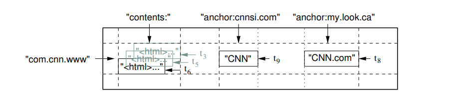

# 6주차 발표자료

Bigtable은 대규모의 구조화된 데이터를 관리하기 위한 분산 저장 시스템

수천 대의 일반 서버에 걸쳐 페타바이트 단위의 데이터를 처리하도록 설계되었다.

- 1PB = 약 1000조 바이트 = 약 1024TB
- 개인 컴퓨터: GB~TB 단위, 기업 서버: PB단위, 전 세계 인터넷 데이터: EB~ZB

Google의 많은 프로젝트가 Bigtable을 사용하고 있으며, 대표적으로 google Earth, Google Finance, youtube, gmail, 웹 인덱싱 등이 있다.

이들 애플리케이션은 데이터 크기(URL에서  웹 페이지, 위성 이미지까지)나 지연 시간 요구 사항(백엔드 대량 처리부터 실시간 서비스까지)이 매우 다양하다.

이처럼 서로 다른 요구에도 불구하고, Bigtable은 이러한 Google 제품들에 대한 유연하면서도 고성능의 솔루션을 성공적으로 제공해왔다.

이 논문에서는 Bigtable이 제공하는 단순한 데이터 모델을 설명하고, 이 모델이 클라이언트가 데이터의 레이아웃과 형식을 동적으로 제어할 수 있게 하는 방법을 다룬다.

# 1장. 서론

Bigtable은 페타바이트 규모의 데이터와 수천 대의 머신으로 안정적으로 확장되도록 설계되었다.

Bigtable은 다음과 같은 목표를 달성했다.

- 광범위한 적용성 (Wide Applicability)
- 확장성 (Scalability)
- 고성능 (High Performance)
- 고가용성 (High Availability)

많은 면에서 Bigtable은 데이터베이스와 비슷하다. 

여러 데이터베이스 시스템에서 사용되는 구현 전략을 공유한다.

병렬 데이터베이스와 인메모리 데이터베이스는 이미 높은 확장성과 성능을 달성했지만, Bigtable은 이들과는 다른 인터페이스를 제공한다.

Bigtable은 완전한 관계형 데이터 모델을 지원하지 않는다.

대신, 클라이언트에게 단순한 데이터 모델을 제공하며, 데이터의 레이아웃과 형식을 동적으로 제어할 수 있도록 한다.

또한, 클라이언트가 저장 데이터의 지역성을 고려하여 스키마를 설계할 수 있게 하며, 이로 인해 데이터 접근 효율을 스스로 조정할 수 있다.

Bigtable은 데이터 자체를 해석하지 않는 문자열로 취급하지만, 클라이언트는 그 안에 구조화된 데이터(예: JSON, Protocol Buffer)를 직렬화하여 저장할 수 있다.

이 논문은 다음과 같이 구성된다.

- **2장**: 데이터 모델의 상세 설명
- **3장**: 클라이언트 API 개요
- **4장**: Bigtable이 의존하는 Google 인프라(GFS 등)의 개요
- **5장**: Bigtable 구현의 기본 구조
- **6장**: 성능 향상을 위한 최적화
- **7장**: 성능 측정 결과
- **8장**: Bigtable을 사용하는 실제 Google 서비스 사례
- **9장**: 설계 및 운영 과정에서 얻은 교훈
- **10장**: 관련 연구
- **11장**: 결론

---

# 2장. 데이터 모델 (Data Model)

Bigtable은 **희소(sparse)**하고, **분산(distributed)** 되어 있으며, **영속성(persistent)** 인 **다차원 정렬 맵(multidimensional sorted map)이다.**

이 맵은 행(row) 키, 열(column) 키, 타임스탬프(timestamp)로 인덱싱되며, 각 값(value)은 해석되지 않은 바이트 배열(uninterpreted array of bytes) 로 구성된다.

```java
(row: string, column: string, time: int64) → string
```

## 예시 - 웹페이지 저장 테이블



### 1. 행 - `com.cnn.www`

- 행 키는 **URL을 뒤집은 형태(도메인 뒤집기 + 경로)**를 쓴다.
    
    예: [`www.cnn.com`](http://www.cnn.com) → `com.cnn.www`
    
- 이유: 같은 도메인의 페이지들이 사전식 정렬로 서로 이웃하게 저장되며, 해당 사이트 전체를 스캔할 때 연속 I/O가 된다(로컬리티 극대화)
- 동일한 row key에 대한 읽기 또는 쓰기는 원자적으로 수행된다.
    
    (즉, 한 행에 속한 여러 컬럼을 동시에 수정해도, 그 전체가 하나의 트랜잭션처럼 처리된다.)
    

이 설계 덕분에, 동시에 여러 클라이언트가 같은 Row를 수정하더라도 일관성 유지가 쉽다.

예시

1. 사용자 프로필 한 번에 갱신
    
    `profile:name`, `profile:email`, `prefs:lang`을 한 mutation에 담아 업데이트. 요청 중 하나가 실패하면 전부 롤백. 읽는 쪽은 세 필드가 **항상 서로 맞는 상태**로 보게 된다.
    
2. 뷰 카운터/점수 합산
    
    `stats:views`를 여러 서버가 동시에 `+1` 해도, 각 증가는 **원자적 증가 연산**으로 처리되어 결과가 정확히 누적된다. 중간에 값이 꼬이거나 덮어쓰지 않는다.
    

### 2. 컬럼 패밀리와 컬럼 이름

- Bigtable의 컬럼 이름은 `family:qualifier` 형식
- `contents:`
    - 페이지 본문 HTML을 저장하는 패밀리
    - 콜론 뒤에 qualifier가 비어있는(= 기본 칼럼 하나만 쓰는) 케이스를 표현한 것. 즉 `contents:` 라는 하나의 컬럼에 여러 버전이 쌓인다.
- `anchor:*`
    - 이 페이지를 링크한 외부 페이지들의 앵커 텍스트를 저장
    - 즉, 어떤 외부 페이지가 이 페이지를 가리키는 하이퍼링크를 갖고 있었는가를 저장
    - `anchor:cnnsi.com`, `anchor:my.lock.ca` 처럼 링크 출처 도메인을 qualifier로 동적으로 만든다. 스키마 변경 없이 qualifier를 마음껏 늘릴 수 있다.

### 타임스탬프(Timestamps)

Bigtable의 각 셀은 여러 버전의 값을 가질 수 있다.

- 이 버전들은 타임스탬프로 인덱싱된다.

**버전이 쌓이는 방식**

- 한 셀에 값이 바뀔 때마다 새 버전이 타임스탬프 내림차순으로 쌓인다.
- 타임스태프는
    - 자동: 서버 실시간(마이크로초)로 찍힘
    - 수동: 클라이언트가 직접 지정(동시성 제어/재처리에 유용)

예시 (셀 = `com.cnn.www & contents:` )

- ts=1710000009000000 → `"<html>…v9"` ← 가장 최신
- ts=1710000005000000 → `"<html>…v5"`
- ts=1710000003000000 → `"<html>…v3"`

읽을 때 기본은 “최신 1개”가 먼저 나온다. 

과거 이력까지 보고 싶으면 **타임스탬프 범위**나 **최대 버전 수**를 지정해 스캔해야 한다.

**버전 관리**

버전이 너무 많아지는 것을 방지하기 위해, Bigtable은 컬럼 패밀리 단위로 자동 버전 정리 정책(GC)을 지원한다.

클라이언트는 다음 두 가지 방식 중 하나를 선택할 수 있다.

1. 최근 n개 버전만 유지
2. 특정 기간 내의 버전만 유지

### 예시

- `(row=com.cnn.www, col=contents:, ts=1710000003000) -> "<html>…(t3)"`
    - t3 시점의 페이지 본문
- `(row=com.cnn.www, col=contents:, ts=1710000005000) -> "<html>…(t5)"`
    - t5 시점의 페이지 본문
    - `contents:` 는 : 뒤에 없으므로 같은 칼럼 안에서 버전만 다르게 저장하겠다는 의미이다.
- `(row=com.cnn.www, col=anchor:cnnsi.com, ts=1710000008000) -> "CNN" (t8)`
    - `com.cnn.www & anchor:cnnsi.com` 의 t8버전
- `(row=com.cnn.www, col=anchor:cnnsi.com, ts=1710000009000) -> "CNN (updated)" (t9)`
    - `com.cnn.www & anchor:cnnsi.com` 의 t9버전
    - `anchor:xxx` 에서 xxx의 값이 같은 것들끼리 같은 칼럼에 저장
- `(row=com.cnn.www, col=anchor:my.look.ca, ts=1710000008500) -> "CNN.com" (t8.5)`
    - `com.cnn.www & anchor:my.look.ca` 별도 셀이라 자기 버전을 따로 가짐

즉, 각 qualifier마다 버전이 독립적이다.

### `contents:` 의 종류가 여러 개 일 때 → qualifier로 종류를 분리

AMP/모바일/데스크톱, 렌더링 단계별, A/B 실험 버전 등 종류가 다른 HTML을 동시에 갖고 싶다면 qualifier를 다르게 둔다. 각 qualifier(=각 “종류”)는 자기 버전들을 독립적으로 가진다.

예시(행키=`com.cnn.www`, 패밀리=`contents`):

- 데스크톱
    - `(com.cnn.www, contents:html, ts=1710000009000) -> "<html>…desktop v9"`
    - `(com.cnn.www, contents:html, ts=1710000005000) -> "<html>…desktop v5"`
- 모바일
    - `(com.cnn.www, contents:mobile, ts=1710000008500) -> "<html>…mobile v8.5"`
- AMP
    - `(com.cnn.www, contents:amp, ts=1710000008200) -> "<html amp>…"`

### 핵심 흐름

1. 논리 모델
    
    하나의 셀은 `(rowKey, family:qualifier, timestamp) → value`로 식별된다.
    
    `rowKey`가 같으면 논리적으로 같은 “행”에 속하지만, 어떤 `family`에 쓰느냐에 따라 물리 배치가 갈린다.
    
2. 컬럼 패밀리 = 물리 저장 단위
    
    Bigtable은 컬럼 패밀리마다 **로컬리티 그룹/스토리지 경로가 분리된다.**
    
    예를 들어 `contents` 패밀리는 “크고, 압축 강하게, 오래 보관” 정책으로, `anchor` 패밀리는 “작고, 캐시 우선, 버전 1개만” 정책으로 각각 **다른 SSTable 세트**(파일들)에 저장된다.
    
    즉, 같은 `rowKey= com.cnn.www`라도
    
- `contents:` 값들은 `contents`용 SSTable들에,
- `anchor:*` 값들은 `anchor`용 SSTable들에
    
    따로 기록된다.
    
1. 쓰기 시 무슨 일이 일어나나
    
    클라이언트가
    
- `(com.cnn.www, contents:, t6) → "<html>…">`
- `(com.cnn.www, anchor:cnnsi.com, t9) → "CNN"`
    
    이렇게 두 셀을 넣으면, Bigtable은 **패밀리별 MemTable**에 각각 적재한 뒤, 주기적으로 **패밀리별 SSTable**로 flush/compaction을 한다.
    
    행 단위 원자성 덕분에 같은 행에 대한 여러 셀 갱신은 함께 커밋된다.
    
1. 읽을 때는 어떻게 보이나
    
    클라이언트가 `rowKey = com.cnn.www`를 조회하면, 서버는 해당 행이 들어 있는 **태블릿(tablet)**의 인덱스를 따라가고, 그 안에서 **요청한 패밀리들**의 SSTable들을 조회해 **머지된 뷰**로 반환한다.
    
    그래서 논리적으로는 “한 행 안에 `contents:`와 `anchor:*`가 함께 들어있는 것처럼” 보인다.
    
    필요하면 “`contents`만”, “`anchor`만” 필터링해서 더 싸게 읽을 수도 있다.
    
2. 왜 이렇게 나눠 저장하나
    
    패밀리별로 압축, 캐시, TTL, 버전 수, 블룸필터 등 **저장·보존·I/O 정책을 다르게 최적화**하려고 나눠서 저장한다.
    
    예를 들어 본문 HTML은 크고 과거 버전이 유용하니 강한 압축+여러 버전 유지, 앵커 텍스트는 작고 최신만 중요하니 캐시↑+버전 1개 같은 식으로 분리 최적화가 가능하다.
    

---

## 정렬된 키 공간을 범위로 잘라서 Tablet으로 운영한다.

Bigtable은 데이터를 Row Key(행키)의 사전순으로 정렬하여 저장한다.

테이블의 row 범위는 동적으로 분할되며, 이때 각 Row 범위를 Tablet이라고 부른다.

Tablet은 분산과 로드 밸런싱의 최소 단위이다.

따라서 짧은 Row 범위를 조회하는 작업은 일반적으로 소수의 서버와만 통신하면 되기 때문에 매우 효율적이다.

### 0) 초기 상태—키 공간을 연속 구간으로 나눔

- 키 공간을 세 구간으로 쪼갠다:
    
    `[A..F)`, `[F..P)`, `[P..Z)`
    
- 각 구간이 **Tablet**이고, 각각 S1, S2, S3가 맡아 서비스한다.
- 키가 `com.cnn.www#...`, `com.google.www#...`, `com.netflix.www#...` 같은 걸 넣고 읽는다. Bigtable은 이 키들을 정렬 상태로 디스크에 유지한다.

---

### 1) 특정 범위가 핫해짐 → **분할(split)**

- 어느 날 `com.cnn.www#...` 접두어로 시작하는 키들이 폭증했다고 가정. 이 키들은 사전식으로 보면 대략 `[C..D)` 근처에 몰려 있다 가정.
- 이 범위를 포함하는 Tablet이 `[A..F)` 라서 S1 한 대에 과부하가 걸렸다.
- Bigtable은 자동으로 `[A..F)`를 **둘로 쪼갠다**. 예를 들어:
    
    `[A..C)` 와 `[C..F)`
    
    이제 S1은 `[A..C)`만 계속 맡고, 새로 생긴 `[C..F)`는 **S2로 이동**시켜 부하를 분산할 수 있다.
    
- 트래픽이 여전히 `com.cnn.www`에 몰리면 `[C..F)`도 다시 쪼갠다:
    
    `[C..D)` 와 `[D..F)`
    
    이렇게 되면 `com.cnn.www`가 속한 `[C..D)` Tablet을 아예 **S3에 배치**해서, S1·S2·S3가 일을 나눠 갖는다.
    

핵심: **정렬된 키의 연속 구간**이 Tablet이고, **핫한 구간을 더 잘게 쪼개 다른 서버로 옮겨** 트래픽을 분산한다.

---

### 2) 반대로 한가해짐 → **병합/재배치**

- 캠페인이 끝나 `com.cnn.www` 트래픽이 급감했다고 가정.
- `[C..D)` 와 `[D..F)` 두 Tablet을 굳이 따로 둘 필요가 없다면 **병합**해서 `[C..F)`로 합친다.
- 혹은 사용량이 적은 Tablet을 모아 **같은 서버로 재배치**해서 다른 서버를 비워둘 수도 있다. 이게 **로드 밸런싱**이다.

핵심: 사용량에 따라 **잘게–크게**를 오가며 **자동으로 균형**을 맞춘다.

요약

> Bigtable은 정렬된 키 공간을 연속 범위(=Tablet)로 쪼개 여러 서버에 나눠 둔다.
핫한 범위는 더 잘게 쪼개 다른 서버로 옮겨 부하를 분산하고, 한가하면 합치거나 재배치한다.
> 

---

# 3장 API

Bigtable API는 테이블과 컬럼 패밀리를 생성 및 삭제할 수 있는 기능을 제공한다.

또한, **클러스터·테이블·컬럼 패밀리의 메타데이터**(예: 접근 제어 권한 등)를 변경할 수 있는 기능도 지원한다.

## 데이터 조작 (쓰기/삭제/조회)

클라이언트 애플리케이션은 다음과 같은 작업을 수행할 수 있다.

- Bigtable에 값을 쓰거나(write) 삭제(delete)
- 특정 Row의 값을 조회(lookup)
- 테이블의 일부 구간(subset)을 반복(iterate)하며 탐색

### 쓰기 예시

```java
// 테이블 열기
Table *T = OpenOrDie("/bigtable/web/webtable");

// 새 anchor 추가 및 오래된 anchor 삭제
RowMutation r1(T, "com.cnn.www");
r1.Set("anchor:www.c-span.org", "CNN");
r1.Delete("anchor:www.abc.com");

Operation op;
Apply(&op, &r1);

```

1. `Table *T = OpenOrDie("/bigtable/web/webtable");`
    
    해당 경로의 Bigtable 테이블을 연다. 실패하면 프로세스를 종료한다. 이후 모든 연산은 이 핸들(T)을 통해 수행된다.
    
2. `RowMutation r1(T, "com.cnn.www");`
    
    행 키가 `com.cnn.www`인 **단일 행**에 대한 변경 묶음을 만든다. 이 객체에 여러 연산(셋/삭제 등)을 쌓아두었다가 나중에 한 번에 보낸다. 
    
    Bigtable은 **행 단위 원자성**을 제공하므로, r1에 담긴 모든 변경은 전부 적용되거나 전부 적용되지 않는다(중간 상태 노출 없음).
    
3. `r1.Set("anchor:www.c-span.org", "CNN");`
    
    컬럼 `family:qualifier = anchor:www.c-span.org`에 값 `"CNN"`을 기록한다.
    
- 이때 **타임스탬프**는 보통 서버가 자동으로 찍는 **실시간(마이크로초)** 이 들어간다(클라이언트가 직접 지정하는 API 변형도 있다).
- 같은 셀(`com.cnn.www` & `anchor:www.c-span.org`)의 **기존 값들은 “과거 버전”**으로 남고, 이번 쓰기가 **최신 버전**이 된다.
- 즉, “덮어쓰기”가 아니라 **버전 추가**에 가깝다. 과거 버전 유지 여부는 **컬럼 패밀리의 GC 정책**(MaxVersions / TTL)에 따라 정리된다.
1. `r1.Delete("anchor:www.abc.com");`
    
    컬럼 `anchor:www.abc.com`을 삭제한다.
    
    의미와 범위:
    
- 별도 한정이 없으면 **그 컬럼의 모든 버전**을 지우는 의미다(“컬럼 삭제”).
- 삭제도 내부적으로는 **삭제 마커(tombstone)** 기록 → 컴팩션(compaction) 시 실제 데이터가 정리되는 방식이다.
1. `Operation op; Apply(&op, &r1);`
    
    방금 만든 행 단위 변경(r1)을 **한 번의 원자적 변이(mutation)**로 적용한다.
    
    중요한 점:
    
- `Set`과 `Delete`가 **같은 행**에 대해 **한 트랜잭션처럼** 함께 커밋된다.
- 병행 갱신과의 상호작용에서 **셀 단위로 값이 섞여 보이지 않는다**. 읽는 쪽은 “적용 전 상태” 또는 “적용 후 상태” 중 하나만 본다.
- 동일 셀에 동시 쓰기가 경합하면 **타임스탬프가 더 큰 쪽**(보통 더 나중에 도착한 쓰기)이 최신이 된다. 경쟁을 제어하려면 **조건부 갱신(Compare-and-Mutate / CheckAndMutate)** 같은 패턴을 쓴다.
- `op`에는 보통 상태/에러 정보가 담긴다(구현체마다 다르지만, 실패 시 재시도·백오프가 일반적).

---

### 읽기 예시

```java
Scanner scanner(T);
ScanStream *stream;
stream = scanner.FetchColumnFamily("anchor");
stream->SetReturnAllVersions();
scanner.Lookup("com.cnn.www");

for (; !stream->Done(); stream->Next()) {
  printf("%s %s %lld %s\n",
         scanner.RowName(),
         stream->ColumnName(),
         stream->MicroTimestamp(),
         stream->Value());
}

```

**코드 분석**

- `Scanner scanner(T);`
    
    테이블 `T`에 대한 스캐너를 만든다. 스캐너는 서버 쪽 Tablet에서 셀들을 **스트리밍**으로 받아오는 클라이언트 쪽 커서이다.
    
- `ScanStream *stream;` / `stream = scanner.FetchColumnFamily("anchor");`
    
    스캐너에 “이 컬럼 패밀리만 달라”는 **가족 단위 필터**를 건다. 
    
    여기선 `anchor` 패밀리에 속한 컬럼들(`anchor:<qualifier>`)만 대상으로 한다는 뜻이다.
    
    이때 반환을 소비할 스트림 핸들이 생긴다.
    
- `stream->SetReturnAllVersions();`
    
    기본은 “최신 버전만” 돌려주는 경우가 많은데, 이 호출로 **해당 셀의 모든 남아 있는 버전**을 달라고 요청한다. 
    
    주의: 컬럼 패밀리의 GC 정책(MaxVersions/TTL)으로 이미 삭제된 과거 버전까지 살아나진 않는다. 
    
    “현재 남아 있는 버전들 전부”를 보내달라는 뜻.
    
- `scanner.Lookup("com.cnn.www");`
    
    **이 행(row key)**으로 조회를 시작한다. 
    
    구현에 따라 “정확히 이 행만” 또는 “이 행에서 시작하는 범위”가 될 수 있는데, 논문 예시는 **한 행의 전 컬럼**을 읽는 용도로 쓰고 있다. 
    
    여기서는 `anchor`로 필터했으니 “이 행의 `anchor:*` 컬럼들”만 오게 된다.
    
- `for (; !stream->Done(); stream->Next()) { ... }`
    
    스트림을 한 셀씩 소비하는 루프.
    
    `Done()`이 `true`면 더 이상 셀이 없다는 뜻, `Next()`로 다음 셀로 이동.
    
- `scanner.RowName()`
    
    현재 셀의 **행 키(row key)**를 준다. 여기서는 계속 `"com.cnn.www"`일 것.
    
- `stream->ColumnName()`
    
    현재 셀의 **컬럼 이름**을 `family:qualifier` 문자열로 준다. 
    
    예: `anchor:cnnsi.com`, `anchor:my.look.ca` …
    
- `stream->MicroTimestamp()`
    
    현재 셀 버전의 **타임스탬프(마이크로초, 64비트 정수)**. 
    
    같은 `(row, column)`이라도 버전마다 값이 다르다.
    
     **보통 내림차순(최신→과거)**으로 오도록 서버가 정렬해 보낸다.
    
- `stream->Value()`
    
    현재 셀의 **값(value)**. 
    
    여기에 실제 페이로드(예: `"CNN"`, `"CNN.com"`)가 UTF-8 바이트로 들어있다. Bigtable은 값 타입을 강제하지 않아서 원시 바이트다.
    

**출력 예시**

```java
com.cnn.www anchor:cnnsi.com      1710000009000000  CNN
com.cnn.www anchor:cnnsi.com      1710000008000000  CNN (old text)
com.cnn.www anchor:my.look.ca     1710000008500000  CNN.com
com.cnn.www anchor:news.yc        1710000012000000  CNN homepage

```

주의사항

- 버전이 많거나 qualifer가 수천 개인 행을 그대로 전부 읽으면 비용이 커진다.
    1. 최신만 반환
    2. 타임스탬프 범위 제한
    3. qualifier 접두어/정확일치 필터
    
    같은 필터를 추가해 필요한 것만 좁혀 받는다.
    
- 방문 로그처럼 셀이 폭증하는 워크로드는 행을 너무 비대하게 만들지 않도록 행 설계(솔트/버킷/시간 분할)를 병행해야 한다.
    - 방문 로그는 한 페이지(row)에 이벤트가 무한히 붙으면서 “한 행이 비대해지는(wide row)” 문제가 생기기 쉽다.
    - 이를 피하려면 row key를 쪼개서 분산시키는 게 핵심이다.
- `Vaule()`는 원시 바이트이므로, 바이너리일 수도 있다. 문자열로 가정하면 깨질 수 있으니 형식을 알고 디코딩해야 한다.

---

## Bigtable의 고급 기능

---

### 1. 단일 Row 트랜잭션 (Single-Row Transactions)

- 하나의 Row Key 아래에 저장된 데이터에 대해 **읽기-수정-쓰기** 작업을 원자적으로 수행할 수 있다.
- 단, **여러 Row Key에 걸친 범용 트랜잭션**은 현재 지원하지 않는다.
- 대신, 클라이언트 측에서 여러 Row에 대한 일괄 쓰기(batch write) 인터페이스를 제공한다.

---

### 2. 카운터(Counter) 기능

- Bigtable의 셀은 정수형 카운터(integer counter)로 사용할 수 있다.
- 즉, 특정 값에 대해 원자적으로 증가/감소 연산을 수행할 수 있다.
    - 동시에 100개의 서버가 같은 카운터에 +1을 시도해도 최종 값은 정확히 기존 +100이 된다.
    - 이 원자성은 행(row) 단위 격리에 기대고 있다. 같은 행의 같은 셀에 대한 증감이 서로 섞이지 않는다.
- 이는 예를 들어 페이지 뷰 수, 좋아요 수 등의 통계를 저장할 때 유용하다.
- 또한 대규모 트래픽에서 실시간 집계가 필요하지만, 전체 로우 스캔이나 트랜잭션을 쓰긴 부담스러울 때 유용하다.

---

### 3. 서버 측 스크립트 실행

- Bigtable은 태블릿 서버 내부 주소 공간에서 클라이언트가 제공한 스크립트를 실행할 수 있다.
- 이 스크립트는 Google이 개발한 Sawzall이라는 데이터 처리 언어로 작성된다.
    - 현재 Sawzall 기반 API는 Bigtable에 직접 쓰기는 지원하지 않지만,
        
        다음과 같은 작업을 지원한다.
        
        - 데이터 변환(Transformation)
        - 임의의 표현식 기반 필터링(Filter)
        - 다양한 연산자를 통한 요약(Summarization)

즉, Sawzall 스크립트를 사용하면 Bigtable에 저장된 데이터를 서버 측에서 직접 가공하거나 집계할 수 있다.

언제 유용한가

- 페이지뷰/좋아요 같은 숫자 요약을 테이블에서 바로 뽑고 싶을 때
- 복잡한 WHERE/CASE 논리로 행을 거리고 특정 필드만 변환해서 요약 테이블을 만들 때
- 도메인/사용자/시간창 기준의 그룹별 통계를 빠르게 구할 때

---

### 4. MapReduce와의 통합

**MapReduce**

많은 컴퓨터에 일을 나눠서(맵) 처리하고, 결과를 모아(리듀스) 하나로 합치는 대용량 배치 처리 방식

**동작원리**

1. 입력 분할: 큰 데이터를 여러 조각(스플릿)으로 나눔
2. Map 단계: 각 조각을 서로 다른 워커가 읽어 `map(key, value)` 실행 → 중간 (k, v) 쌍들을 뿌림
3. Shuffle/Sort: 같은 k를 가진 값들이 네트워크로 한 곳에 모이고 정렬됨
4. Reduce 단계: `reduce(k, [v...])` 가 k 별로 값을 집계/요약
5. 출력: 결과를 파일시스템에 저장 

**Bigtable과 MapReduce의 통합**

**Bigtable에 있는 거대한 데이터**를 MapReduce로 **대규모 변환·집계·지표 생성**하고, **결과를 다시 Bigtable**에 적재할 수 있다.

**작업 흐름**

1. **스캔 설정**
    - “어느 테이블/행 범위/패밀리/버전”을 읽을지 입력 래퍼에 지정:
        - 예: `table=Visits`, `range=[page#A..page#C)`, `family=evt`, `ts <= 어제 24시`
2. **스플릿 생성 → 맵 배치**
    - 선택된 범위가 **여러 태블릿**에 걸쳐 있으면 태블릿마다 **스플릿**이 생기고, 각 스플릿이 **하나의 Map 태스크**가 됨.
3. **Map 단계**
    - 각 Map 태스크는 자기 스플릿(=일부 태블릿 범위)에서 **(row, family:qualifier, timestamp, value)**를 읽어 사용자 `map()` 함수에 넘겨.
    - `map()`은 (필요하면 파싱/필터) → **중간 (key, value)**를 `emit`.
4. **Shuffle/Sort**
    - 같은 key 끼리 네트워크로 모여 정렬됨.
5. **Reduce 단계**
    - `reduce(key, values)`가 **집계/요약/변환**을 수행해서 **최종 결과**를 만든다.
6. **출력(쓰기)**
    - 출력 래퍼가 결과를 **Bigtable 테이블/행/컬럼**에 적재(put/increment/check-and-mutate 등).
    - 필요하면 **새 테이블**에 적재해 **서빙 테이블과 분리**(안전·유연).

---

## 3장 요약

- Bigtable API는 테이블 및 컬럼 패밀리 관리, 메타데이터 변경, 읽기/쓰기/삭제를 지원한다.
- 모든 Row 연산은 **원자적(Atomic)** 이며, 트랜잭션 일관성이 보장된다.
- 스캐너(Scanner)를 통해 **Row, Column, Timestamp 범위를 제한**하여 효율적 탐색이 가능하다.
- 고급 기능:
    - **Single-row 트랜잭션**
    - **Integer Counter 지원**
    - **Sawzall 기반 서버 측 데이터 처리**
    - **MapReduce와의 직접 통합**

---

# 4장 구성 요소

Bigtable은 여러 다른 Google 인프라 구성 요소 위에 구축되어 있다.

---

## GFS (Google File System)

Bigtable은 분산 파일 시스템인 Google File System(GFS)을 사용하여 로그와 데이터 파일을 저장한다.

Bigtable 클러스터는 보통 공유 머신 풀(shared pool of machine) 위에서 동작한다.

이 머신 풀에서는 여러 종류의 분산 애플리케이션이 함께 실행되며, Bigtable 프로세스 또한 다른 애플리케이션의 프로세스들과 같은 서버를 공유한다.

Bigtable은 클러스터 관리 시스템에 의존한다.

이 시스템은 다음과 같은 역할을 수행한다.

- 작업(Job) 스케줄링
- 공유 머신의 리소스 관리
- 머신 장애 처리
- 머신 상태 모니터링

### 공유 머신 풀에는 어떤 것이 같이 올라갈까?

- **저장 계층(Storage)**
    - GFS(또는 후속 분산 FS)의 **청크서버**·메타 서비스
    - **Bigtable/Spanner** 같은 분산 저장·데이터베이스 서버
    - 메시징/로그 수집(예: 분산 로그 인프라의 브로커/에이전트)
- **배치/데이터 처리(Throughput jobs)**
    - **MapReduce** 워커(맵/리듀스 태스크)
    - 스트리밍/배치 파이프라인(ETL, 집계, 모델 학습 등)
- **서빙/온라인 서비스(Latency-sensitive)**
    - 검색/광고/메일/지도 등 **마이크로서비스 백엔드**
    - API 게이트웨이, 추천/랭킹/피처 조회 서비스
- **크롤링/색인·파이프라인**
    - **웹 크롤러**, 색인 생성(인덱싱), 피처 생성 작업
- **운영/관측 도구**
    - 모니터링·알람, 메트릭 수집기, 추적(트레이싱) 에이전트

### 공유 머신 풀

1. **항상 켜져 있어야 하는 것들이 있음 (long-running 서비스)**
    - Bigtable의 **마스터/태블릿 서버**, GFS의 **마스터/청크서버**, 검색/광고 같은 **온라인 서비스**는 “항상 살아 있어야” 한다.
    - 다만 “항상 같은 머신”에서 도는 게 아니라, **공유 풀 어딘가**에서 **N개를 유지**하도록 스케줄러가 보장한다.
    - 머신이 죽거나 유지보수가 필요하면 스케줄러가 **다른 머신으로 옮겨 재시작**하고, 클라이언트 입장에선 거의 끊김 없이 계속 살아있는 것처럼 보이게 한다.
2. **자원을 왔다갔다 공유하는 것도 맞음**
    - 같은 풀에 **배치/분산 작업(MapReduce 등)**도 함께 올라온다. 이건 **잠깐 돌고 끝나는 잡**이라 남는 리소스를 쓸 수 있고, 바쁘면 **중단/선점(preempt)** 당해도 된다.
    - 스케줄러는 **우선순위/쿼터/격리**(CPU·메모리·디스크·네트워크)를 써서
        - 지연 민감한 “항상 켜져야 하는 서비스”에는 **보장된 자원**을 주고,
        - 배치 잡은 **남는 자원**에서 유연하게 돌린다.

**요약**

- **항상 켜져야 하는 것**: 최소 인스턴스 수를 설정(예: 태블릿 서버 200개). 스케줄러가 **어느 머신이든** 이 개수를 유지.
- **공유/이동**: 특정 머신에 장애/점검이 생기면 그 위의 프로세스를 **다른 머신으로 이동**(재시작). 데이터는 GFS에 있으니 **빨리 복구**.
- **여유 자원 활용**: 밤엔 배치 잡이 풀 가용 CPU를 쓰고, 낮에 트래픽이 오르면 스케줄러가 배치 잡을 **축소/중단**해서 온라인 서비스에 자원을 돌림.
- **“항상 켜져 있다”**는 건 **프로세스의 목표 개수/가용성을 스케줄러가 계속 유지**한다는 뜻이고,
- 공유 풀은 **그 프로세스들이 어느 머신에서 도는지, 필요할 때 옮기고 늘리고 줄이는지**를 **유연하게** 관리한다는 뜻이다.

---

## SSTable 파일 포맷

Bigtable은 내부적으로 데이터를 저장하기 위해 Google SSTable 파일 포맷을 사용한다.

SSTable은 영속적(persistent)이고 불변(immutable)한 정렬된 맵(sorted map)으로, Key → Value 형태로 데이터를 매핑한다.

Key와 Value는 모두 임의의 바이트 배열이다.

SSTable이 제공하는 주요 연산

- 특정 key에 대응하는 Value 조회
- Key 범위 내의 모든 key/Value 쌍 반복

### SSTable 내부 구조

SSTable은 디스크에 이렇게 놓여 있다

```
[데이터 블록 #0][데이터 블록 #1] ... [데이터 블록 #N][(메타)인덱스 블록][푸터]

```

- **데이터 블록**: 정렬된 `(key, value)` 쌍이 여러 개 들어있는 조각.
    
    보통 **블록 크기를 64KB** 정도로 잡지만 **설정 가능**
    
- **인덱스 블록**: “각 데이터 블록의 **첫(또는 마지막) 키** → **그 블록의 파일 오프셋/길이**”를 담은 **작은 목차**.
- **푸터(footer)**: 파일 맨 끝의 고정 길이 영역. 인덱스 블록이 **어디(offset)부터 얼마나(size)** 있는지, (필요하면) 메타 인덱스 위치, 포맷 식별자 등을 담음.
- SSTable의 끝 부분에는 블록 인덱스가 저장되어 있으며, SSTable이 열릴 때 이 인덱스는 메모리에 로드된다.

### 조회 과정

1. 푸터를 한 번 읽어 인덱스 블록의 위치/크기를 알아낸다.
2. 그 오프셋으로 가서 인덱스 블록 전체를 메모리에 읽어온다.
3. 이제 특정 키를 찾을 때는 메모리 속 인덱스에서 이진 탐색으로 “어느 데이터 블록에 있을지”를 곧장 계산하고, 그 해당 블록만 디스크에서 읽으면 된다.

→ 랜덤 조회가 보통 “ 인덱스는 메모리 히트 + 데이터 블록 1회 I/O”로 끝난다.

## Chubby: 분산 락 서비스

Bigtable은 Chubby라 불리는 고가용성과 영속성을 가진 분산 락 서비스에 의존한다.

---

### Chubby 구조

- Chubby 서비스는 5개의 활성 복제본으로 구성된다.
- 그 중 하나가 마스터로 선출되어 클라이언트로 요청을 처리한다.
- 복제본 중 과반수가 실행 중이며 서로 통신이 가능하면, 서비스는 “정상 상태(live)”로 간주된다.
    - 네트워크 분할이 생겨도 다수파 쪽만 계속 서비스하고, 소수파는 멈춰 일관성을 지킨다.
- Chubby는 Paxos 알고리즘을 사용하여 장애 상황에서도 복제본 간의 일관성을 유지한다.
    - “누가 리더인지”, “이 파일의 최신 버전은 무엇인지”가 중복 서버 간에도 하나로 합쳐서 유지된다.

---

### 네임스페이스와 락

Chubby는 디렉토리와 작은 파일로 이루어진 네임스페이스를 제공한다.

- 각 디렉토리나 파일은 락으로 사용할 수 있다.
    - 파일을 열 때 나만 쓰겠다는 배타 락을 잡는 식으로 합의된 소유권을 표현한다.
    - 리더 선출: 여러 프로세스가 `/service/leader` 파일의 배타 락을 경쟁. 한 명만 성공 → 리더. 나머지는 watch 걸고 대기. 락이 풀리면(리더 죽음/종료), 알림 받고 재경쟁
    - 서비스 디스커버리/헬스: Bigtable 태블릿 서버가 `/bigtable/servers/<id>` 파일을 만들고 락 유지.
        
        세션이 끊기면 락이 자동 해제/파일이 사라져 마스터가 즉시 감지하고 재할당
        
- 파일에 대한 읽기와 쓰기는 원자적으로 수행된다.
    - 한 번의 write는 전체 파일을 일관되게 바꾸고, 중간 상태는 안 보임

Chubby 클라이언트 라이브러리와 Chubby 파일에 대해 일관된 캐시를 제공한다.

- Chubby 클라이언트 라이브러리는 네임스페이스(디렉터리 목록, 파일 메타/내용)를 캐시한다. 읽기가 잦은 메타데이터를 매번 네트워크 왕복 없이 쓰게 하려는 것

**캐시가 어떻게 일관성을 유지?**

1. 클라이언트가 파일/디렉터리를 **open + watch** 한다.
2. 누군가 그 객체를 바꾸면, **마스터가 해당 객체를 캐시한 클라이언트에게 “무효화(invalidate)” 콜백**을 보낸다.
3. 콜백을 받은 클라이언트는 **캐시를 즉시 버리고** 필요하면 **다시 읽어 최신 상태**를 가져온다.

**효과**

- 평소엔 **로컬 캐시**로 빠르게 읽고,
- 변경 시엔 **푸시형 무효화**로 **강한 일관성**을 맞춘다(“적어도 바뀐 뒤에는 옛값을 계속 쓰지 않게”).

---

### Bigtable과 Chubby의 통합 역할

Bigtable은 Chubby를 다양한 목적에 사용한다.

1. **마스터 중복 방지** (Active Master 보장)
    
    한 시점에 **활성 마스터(active master)** 가 하나만 존재하도록 보장
    
    어떻게?
    
    - 마스터들은 Chubby의 특정 파일(예: `/bigtable/master`) 에 배타 락(exclusive lock)을 경쟁해서 잡는다.
        
        → 한 프로세스만 락을 획득 → 그가 유일한 Active Master
        
        → 락이 풀리면(프로세스 죽음/세션 만료), 대기 중이던 다른 마스터가 즉시 선출(Watch 알림)
        
    
    왜 중요한가?
    
    - 리더가 둘이면 태블릿 할당이 충돌해 데이터 일관성이 깨진다.
2. **부트스트랩 정보 저장** (초기 위치 찾기)
    
    Bigtable이 기동될 때 **루트 태블릿(= METADATA의 첫 태블릿) 위치**를 알아야 전체 태블릿 위치 계층을 따라갈 수 있다.
    
    - **어떻게?**
        
        Chubby의 작은 파일에 **루트 태블릿 위치**가 저장됨(예: “어느 태블릿 서버가 루트를 서빙 중인지”).
        
        클라이언트/마스터가 시작 시 이 파일을 읽어 **첫 단추**를 꿰고, 이후는 **METADATA 테이블**을 따라가며 모든 태블릿 위치를 파악한다.
        
    - **효과**
        
        “어디서부터 시작해야 하지?”를 **항상 안정적으로** 알 수 있다(파일은 작고, Paxos로 일관 보장).
        
3. **Tablet 서버 관리** (발견, 모니터링, 종료 확정)
    - **발견(Discovery)**
        
        각 태블릿 서버는 `/bigtable/servers/<server-id>` 같은 **Chubby 파일을 만들고 배타 락을 획득**한 채 **주기적으로 유지**한다
        
        마스터는 해당 디렉터리를 **watch**해서 **새 서버 등장/사라짐**을 즉시 알 수 있다.
        
    - **죽은 서버의 종료 확정(Finalization)**
        
        서버가 죽거나 네트워크가 끊기면 **세션이 끊겨 락이 자동 해제**되고 파일이 사라지거나 접근 불가가 된다.
        
        마스터는 확인 절차를 거쳐 **그 서버가 다시는 서빙하지 못하게** Chubby에서 **서버 파일을 삭제**하고, 그 서버가 맡던 **태블릿을 미할당 큐로 이동** → 다른 서버에 **재할당**.
        
        (혹여 네트워크 분할로 좀비가 되더라도 **락이 없으면 서빙 불가**라 안전)
        
    - **권한 확인(옵션)**
        
        “누가 쓰기 가능한가” 같은 **허용 목록**을 Chubby 파일에 두고, 태블릿 서버는 **로컬 캐시**로 빠르게 확인(변경 시 Chubby가 **무효화 알림**).
        

---

### **Chubby 장애 시 영향**

Chubby가 장시간 사용할 수 없게 되면(Bigtable이 Chubby에 의존하기 때문),

**Bigtable 전체도 사용할 수 없게 된다.**

Google은 이 영향을 14개의 Bigtable 클러스터(11개의 Chubby 인스턴스에 걸친)에서 측정했다.

그 결과는 다음과 같다.

- **평균적으로**, Bigtable 서버 가동 시간 중
    
    Chubby 불가용성(서비스 중단 또는 네트워크 장애 등)으로 인해
    
    일부 데이터가 접근 불가능했던 비율은 **0.0047%**.
    
- **가장 큰 영향을 받은 클러스터**의 경우에도
    
    불가용 비율은 **0.0326%** 에 불과했다.
    

즉, Chubby의 안정성은 Bigtable의 전체 신뢰성과 가용성에 직접적인 영향을 미치지만, 실제 운영에서는 매우 높은 수준의 가용성을 유지하고 있다.