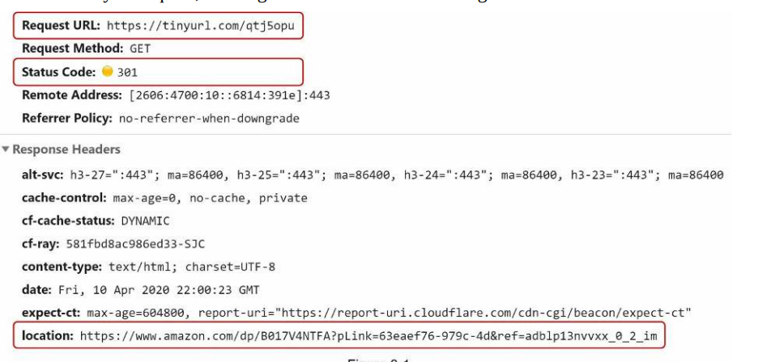
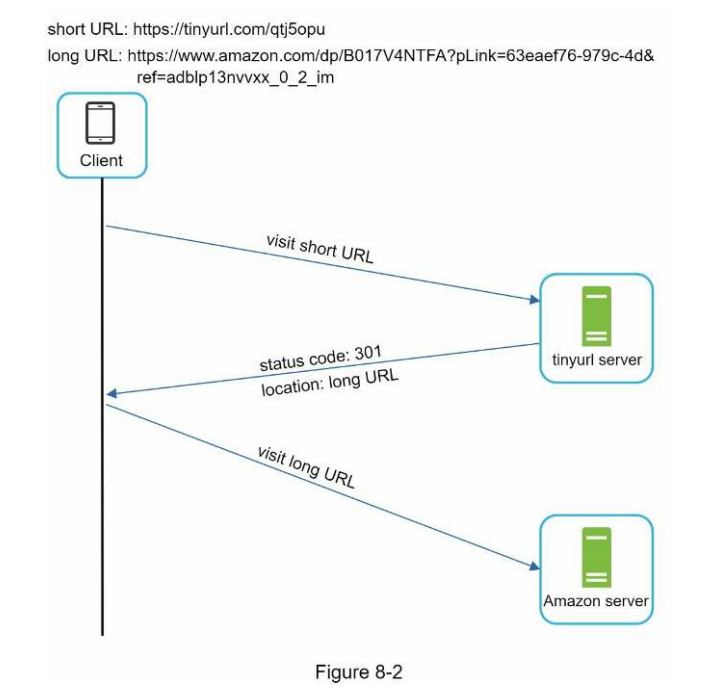
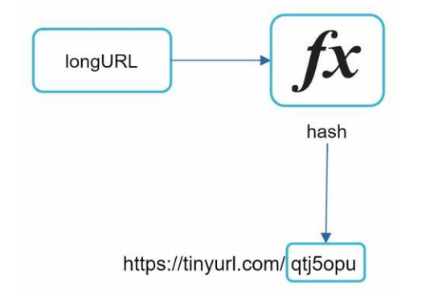
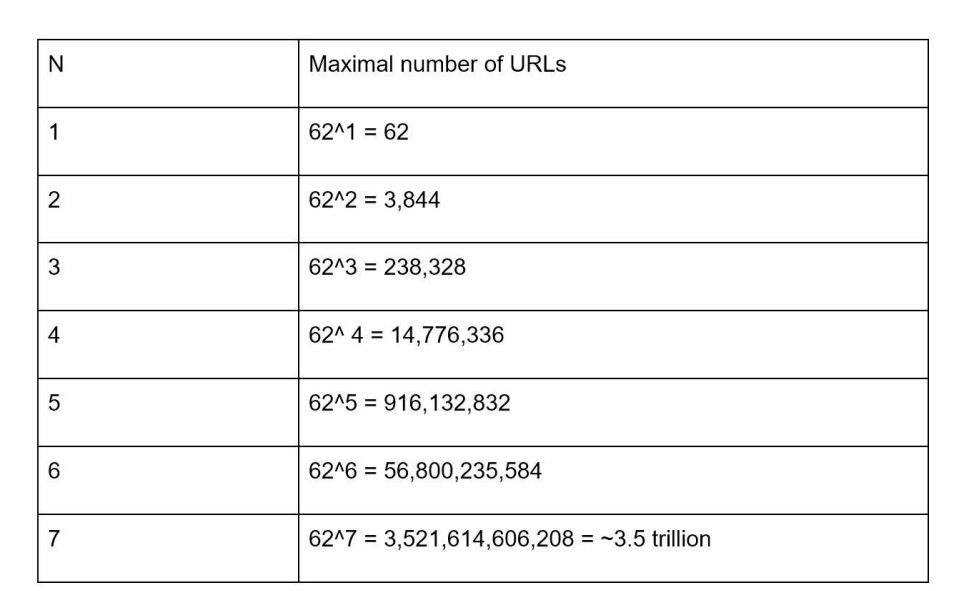
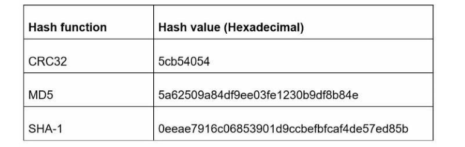
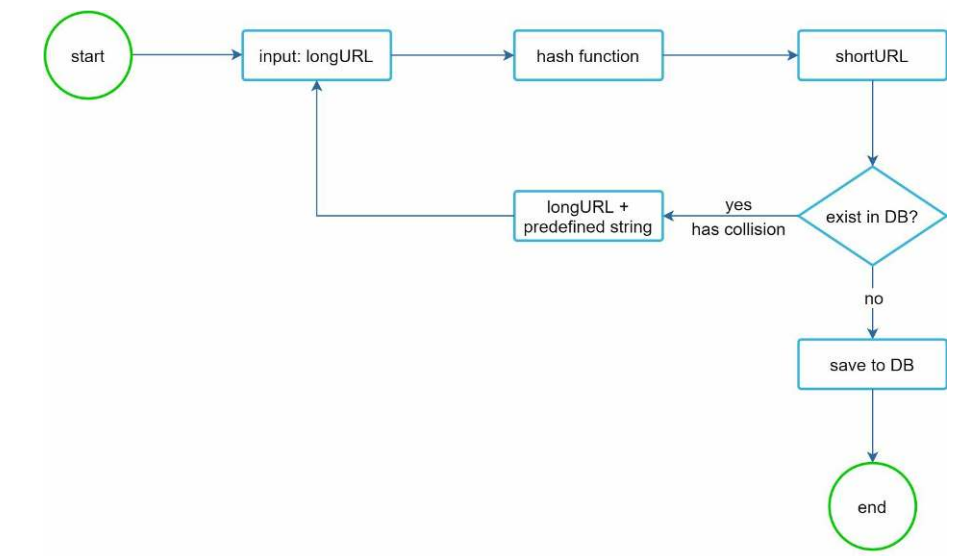
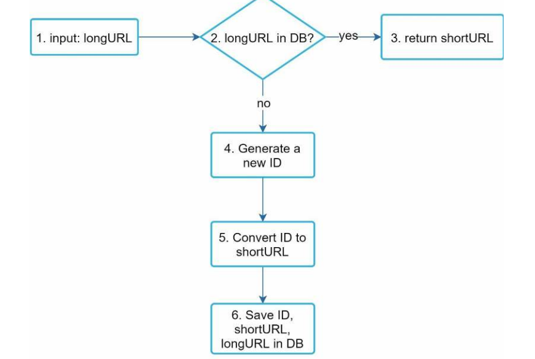
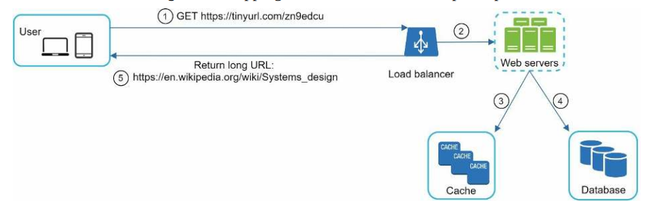

# 8장. URL 단축기 설계

```
[https://www.systeminterview.com/q=chatsystem&c=loggedin&v=v3&l=long →](https://www.systeminterview.com/q=chatsystem&c=loggedin&v=v3&l=long) [https://tinyurl.com](https://tinyurl.com/)
```

다음과 같이 입력으로 주어진 긴 URL을 단축 URL로 결과를 제공해야 한다.

단축 URL에서 접속하면 원래 URL로 갈 수도 있어야 한다.

# 1단계 문제 이해 및 설계 범위 확정

## 기본적인 기능

1. URL 단축: 주어진 긴 URL을 훨씬 짧게 줄인다.
2. URL 리디렉션(redirection): 축약된 URL로 HTTP 요청이 오면 원래 URL로 안내
3. 높은 가용성과 규모 확장성, 그리고 장애 감내가 요구됨

## 개략적 추정

- 쓰기 연산: 매일 1억 개의 단축 URL 생성
- 초당 쓰기 연산: 1억(100million)/24/3600 = 1160
- 읽기 연산: 읽기 연산과 쓰기 연산 비율은 10:1이라고 하자. 그 경우 읽기 연산은 초당 11,600회 발생한다(1160*10 = 11,600)
- URL 단축 서비스를 10년간 운영한다고 1억(100million)*365*10 = 3659억(365billion) 개의 레코드를 보관해야 한다.
- 축약 전 URL의 평균 길이는 100이라고 하자.
- 따라서 10년 동안 필요한 저장 용량은 3650억(365billion)*100바이트 = 36.5TB이다.

# 2단계 개략적 설계안 제시 및 동의 구하기

## API 엔드포인트

클라이언트는 서버가 제공하는 API 엔드포인트를 통해 서버와 통신한다.

→ 이 엔드포인트를 REST 스타일로 설계할 것이다.

URL 단축기 엔드포인트

### 1. URL 단축용 엔드포인트

- 새 단축 URL을 생성하고자 하는 클라이언트는 이 엔드포인트에 단축할 URL을 인자로 실어서 POST 요청을 보내야 한다.

POST /api/v1/data/shorten

- 인자: {longUrl: longURLstring}
- 반환: 단축 URL

### 2. URL 리디렉션용 엔드포인트

- 단축 URL에 대해서 HTTP 요청이 오면 원래 URL로 보내주기 위한 용도의 엔드포인트

GET /api/v1/shortUrl

- 반환: HTTP 리디렉션 목적지가 될 원래 URL

## URL 리디렉션



단축 URL을 받은 서버는 그 URL을 원래 URL로 바꾸어서 301 응답의 Location 헤더에 넣어 반환한다.



## 301응답 vs 302응답

### 301 Permanently Moved

- 해당 URL에 대한 HTTP 요청의 처리 책임이 영구적으로 Location 헤더에 반환된 URL로 이전되었다는 응답
- 영구적으로 이전되었으므로, 브라우저는 이 응답을 캐시한다.
- 추후 같은 단축 URL에 요청을 보낼 필요가 있을 때 브라우저는 캐시된 원래 URL로 요청을 보내게 된다.

### 302 Found

- 주어진 URL로의 요청이 일시적으로 Location 헤더가 지정하는 URL에 의해 처리되어야 한다는 응답
- 클라이언트의 요청은 언제나 단축 URL 서버에 먼저 보내진 후에 원래 URL로 리디렉션 되어야 한다.

서버 부하를 줄이는 것이 중요 → 301 Permanent Moved

→ 첫 번째 요청만 단축 URL 서버로 전송될 것이기 때문

트래픽 분석이 중요 → 302 Found

→ 클릭 발생률이나 발생 위치를 추적하는 데 좀 더 유리

URL 리디렉션 구현 가장 직관적인 방법 → 해시 테이블

- 원래 URL = hashTable.get(단축 URL)
- 301 또는 302 응답 Location 헤더에 원래 URL을 넣은 후 전송

## URL  단축

중요한 점 : 긴 URL을 이 해시 값으로 대응시킬 해시 함수 fx를 찾는 일



해시 함수 요구사항

- 입력으로 주어지는 긴 URL이 다른 값이면 해시 값도 달라야 한다.
- 계산된 해시 값은 원래 입력으로 주어졌던 긴 URL로 복원될 수 있어야 한다.

# 3단계 상세 설계

## 데이터 모델

해시 테이블 문제점

→ 메모리는 유한한 데다 비쌈

더 나은 방법 <단축 URL, 원래 URL>의 순서쌍을 관계형 데이터베이스에 저장하는 것

→ id, shorURL, longURL의 세 개의 칼럼을 갖는다.

## 해시 함수

해시 함수는 원래 URL을 단축 URL로 변환하는 데 쓰인다.

### 해시 값 길이

hashValue는 [0-9, a-z, A-Z]의 문자들로 구성된다.

따라서 사용할 수 있는 문자의 개수는 10+ 26 + 26 = 62개다.

hashValue의 길이를 정하기 위해서는 62^n ≥ 3650억(365billion)인 n의 초솟값을 찾아야 한다.

- 개략적으로 계산했던 추정치에 따르면 이 시스템은 3650억 개의 URL을 만들어 낼 수 있어야 한다.



hashValue의 길이와, 해시 함수가 만들 수 있는 URL의 개수 사이의 관계

n=7이면 3.5조 개의 URL을 만들 수 있다.

→ 따라서 hashValue의 길이는 7로 한다.

해시 함수 구현에 쓰일 기술 

## 해시 후 충돌 해소 vs base-62 변환

### 해시 후 충돌 해소

긴 URL을 줄이려면, 원래 URL을 7글자 문자열로 줄이는 해시 함수가 필요

밑의 표는 URL: [https://en.wikipedia.org/wiki/Systems_design](https://en.wikipedia.org/wiki/Systems_design) 을 축약한 결과



위의 해시 함수로 나온 결과 모두 7보다는 길다.

### 해결 방법

1. 처음 7개 글자만 이용

→ 문제점: 해시 결과 충돌할 확률이 높아짐

충돌이 발생했을 때

→ 충돌이 해소될 때까지 사전에 정한 문자열을 해시값에 덧붙인다.



이 방법을 쓰면 충돌은 해소할 수 있지만 단축 URL을 생성할 때 한 번 이상 데이터베이스 질의를 해야 하므로 오버헤드가 크다.

데이터베이스 대신 블룸 필터를 사용하면 성능을 높일 수 있다.

- 블룸 필터: 어떤 집합에 특정 원소가 있는지 검사할 수 있도록 하는, 확률론에 기초한 공간 효율이 좋은 기술

## base-62 변환

base conversion(진법 변환)은 URL 단축기를 구현할 때 흔히 사용되는 접근법

이 기법은 수의 표현 방식이 다른 두 시스템이 같은 수를 공유하여야 하는 경우에 유용

62진법을 쓰는 이유는 hashValue에 사용할 수 있는 문자 개수가 62개이기 때문이다.

### base-62 변환 과정 (10진수로 11157을 62진수로 변환)

- 62진법은 수를 표현하기 위해 총 62개의 문자를 사용하는 진법
    - 0 → 0 , 9 → 9,  10→ a, 11 → b, 35 → z, 36 → A, 61 → Z
- 11157 = 2*62^2 + 66 * 62^1 + 59 * 62^0 = [2, 55, 59] ⇒ [2, T, X] ⇒ 2TX
- 따라서 단축 URL은 httpsL//tinyurl.com/2TX 가 된다.

## 두 접근법 비교

| 해시 후 충돌 해소 전략 | base-62 변환 |
| --- | --- |
| 단축 URL의 길이가 고정됨 | 단축 URL의 길이가 가변적. ID 값이 커지면 같이 길어짐 |
| 유일성이 보장되는 ID 생성기가 필요치 않음 | 유일성 보장 ID 생성기가 필요 |
| 충돌이 가능해서 해소 전략이 필요 | ID의 유일성이 보장된 후에야 적용 가능한 전략이라 충돌은 아예 불가능 |
| ID로부터 단축 URL을 계산하는 방식이 아니라서 다음에 쓸 수 있는 URL을 알아내는 것이 불가능 | ID가 1씩 증가하는 값이라고 가정하면 다음에 쓸 수 있는 단축 URL이 무엇인지 쉽게 알아낼 수 있어서 보안상 문제가 될 소지가 있음 |

## URL 단축기 상세 설계

URL 단축기는 시스템의 핵심 컴포넌트

→ 논리적으로 단순해야 하고 기능적으로는 언제나 동작하는 상태로 유지되어야 한다.



1. 입력으로 긴 URL을 받는다.
2. 데이터베이스에 해당 URL이 있는지 검사한다.
3. 데이터베이스에 있다면 해당 URL에 대한 단축 URL을 만든 적이 있는 것이다.
    
    따라서 데이터베이스에서 해당 단축 URL을 가져와서 클라이언트에게 반환한다.
    
4. 데이터베이스에 없는 경우에는 해당 URL은 새로 접수된 것이므로 유일한 ID를 생성한다.
    
    이 데이터베이스의 기본 키로 사용된다.
    
5. 62진법 변환을 적용, ID를 단축 URL로 만든다.
6. ID, 단축 URL, 원래 URL로 새 데이터베이스 레코드를 만든 후 단축 URL을 클라이언트에 전달한다.

이 생성기의 주된 용도는, 단축 URL을 만들 때 사용할 ID를 만드는 것이고, 이 ID는 전역적 유일성이 보장되는 것이어야 한다.

## URL 리디렉션 상세 설계

쓰기보다 읽기를 더 자주 하는 시스템이라, <단축 URL, 원래 URL>의 쌍을 캐시에 저장하여 성능을 높였다.



### 로드밸런스 동작 흐름

1. 사용자가 단축 URL을 클릭한다.
2. 로드밸런서가 해당 클릭으로 발생한 요청을 웹 서버에 전달한다.
3. 단축 URL이 이미 캐시에 있는 경우에는 원래 URL을 바로 꺼내서 클라이언트에게 전달한다.
4. 캐시에 해당 단축 URL이 없는 경우에는 데이터베이스에서 꺼낸다. 데이터베이스에 없다면 아마 사용자가 잘못된 단축 URL을 입력한 경우일 것이다.
5. 데이터베이스에서 꺼낸 URL을 캐시에 넣은 후 사용자에게 반환한다.

# 4단계 마무리

### 처리율 제한 장치

- 지금까지 살펴본 시스템은 엄청난 양의 URL 단축 요청이 밀려들 경우 무력화될 수 있다는 잠재적 보안 결함을 갖고 있다.
    - 처리율 제한 장치를 두면, IP 주소를 비롯한 필터링 규칙들을 이용해 요청을 걸러낼 수 있을 것이다.

### 웹 서버의 규모 확장

- 본 설계에 포함된 웹 계층은 무상태 계층이므로, 웹 서버를 자유로이 증설하거나 삭제할 수 있다.

### 데이터베이스의 규모 확장

- 데이터베이스를 다중화하거나 샤딩하여 규모 확장성을 달성할 수 있다.

### 데이터 분석 솔루션

- 성공적인 비즈니스를 위해서는 데이터가 중요하다.
- URL 단축기에 데이터 분석 솔루션을 통합해 두면 어떤 링크를 얼마나 많은 사용자가 클릭했는지,
언제 주로 클릭했는지 등 중요한 정보를 알아낼 수 있을 것이다.

### 가용성, 데이터 일관성, 안정성

- 대규모 시스템이 성공적으로 운영되기 위해서는 반드시 갖추어야 할 속성들이다.