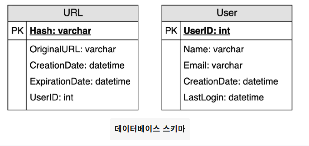
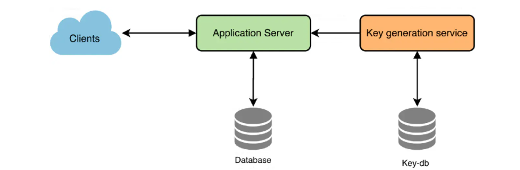
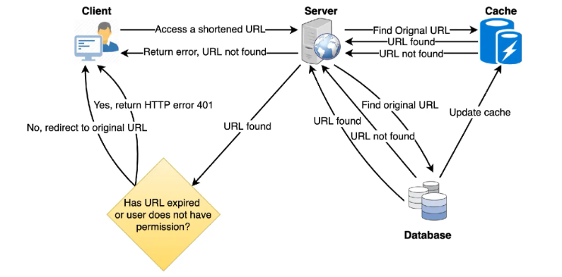
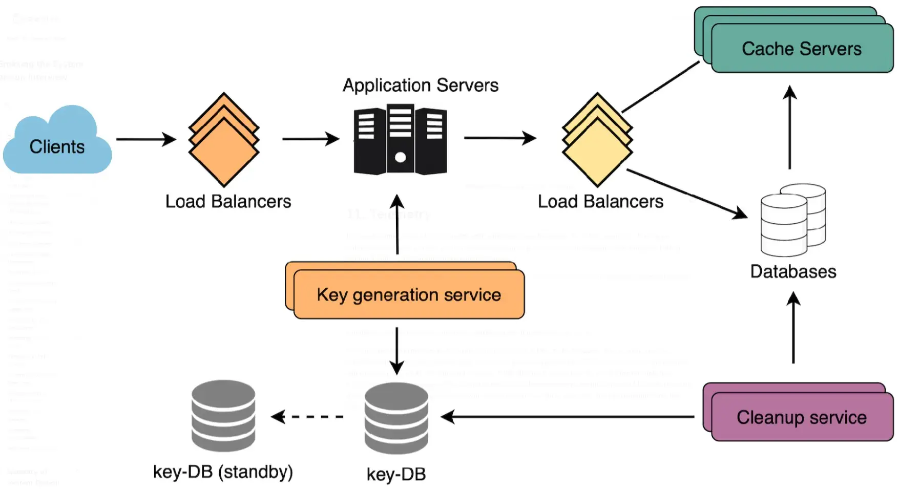

# 7주차 발표자료

# URL 단축 서비스 설계 방법

# 1. URL 단축이 필요한 이유는 무엇인가요?

URL 단축은 긴 URL의 별칭을 줄이는 데 사용된다.

사용자는 이 짧은 링크를 클릭하면 원래 URL로 리디렉션된다.

짧은 링크는 표시, 인쇄, 메시지 전송 또는 트윗 전송 시 많은 공간을 절약한다.

단축된 URL은 실제 URL 크기의 약 1/3 정도이다.

URL단축은 여러 기기에서 링크를 최적화하고, 개별 링크를 추적하여 잠재 고객을 분석하고, 광고 캠페인의 성과를 측정하거나 제휴된 원래 URL을 숨기는 데 사용된다.

# 2. 시스템의 요구 사항 및 목표

### 기능적 요구 사항:

1. URL이 주어지면, 저희 서비스는 해당 URL의 더 짧고 고유한 별칭을 생성
2. 사용자가 짧은 링크에 접속하면, 당사 서비스는 사용자를 원래 링크로 리디렉션
3. 사용자는 선택적으로 자신의 URL에 대한 사용자 정의 짧은 링크를 선택
4. 링크는 표준 기본 기간이 지나면 만료
    - 사용자는 만료 시간을 지정할 수 있어야 한다.

### 비기능적 요구 사항:

1. 고가용성 - 서비스가 중단되면 모든 URL 리디렉션이 실패하기 때문에 필요하다.
2. URL 리디렉션은 최소한의 비용으로 실시간으로 이루어져야 한다.
3. 단축된 링크는 추측할 수 없어야 한다.

### 확장된 요구 사항:

1. 분석, 예를 들어 리디렉션이 몇 번이나 발생했나?
2. 우리 서비스는 다른 서비스의 REST APIs를 통해서 접근 가능해야 한다.

# 3. 용량 추정 및 제약 조건

시스템은 읽기 중심 (읽기 쓰기 비율 100:1 가정)

- 새로운 URL 단축에 비해 리디렉션 요청이 많을 것

### 트래픽 추정:

매달 5억 개의 새로운 URL 단축 발생 → 5억 * 100 = 500억개의 리디렉션 발생

초당 쿼리 수: 5억 / (30일 * 24시간 * 3600초) = ~ 200개 URL/초

100:1의 읽기 쓰기 비율 고려하면 초당 URL 리디렉션

→ 100 * 200 URL/초 = 20K/초

### 저장 공간 추정:

모든 URL 단축 요청(및 관련 단축 링크)을 5년 동안 저장한다고 가정

매달 5억 개의 새로운 URL이 생성 → 5억 * 5년 * 12개월 = 300억

저장된 각 객체가 약 500바이트라 가정

→ 300억 * 500바이트 = 15TB

### 대역폭 추정치:

쓰기 요청의 경우 매초 약 200개의 새로운 URL이 예상됨

→ 서비스에 들어오는 총 데이터: 200 * 500바이트 =  100KB/s

읽기 요청의 경우 매초 약 20000개의 URL 리다렉션 예상

→ 서비스의 총 발신 데이터 : 20k * 500바이트 = ~10MB/s

### 메모리 추정:

자주 액세스되는 인기 URL 중 일부를 캐시하려면 얼마나 많은 메모리가 필요할까?

→ 80-20 규칙

→ 즉 URL의 20%가 트래픽의 80%를 생성한다고 가정하면, 이 20%의 인기 URL을 캐시해야 한다.

초당 요청이 20000개이므로 하루에 17억개의 요청을 받는다.

→ 20K * 3600초 *24시간 = ~17억

이러한 요청의 20%를 캐시하려면 170GB의 메모리가 필요하다.

→ 0.2 *17억 * 500바이트 = ~170GB

주의할 점: 동일한 URL의 중복 요청이 많기 때문에 실제 메모리 사용량은 170GB보다 적다는 것

### 상위 수준 추정치:

매달 5억 개의 새로운 URL과 100:1의 읽기:쓰기 비율 가정 → 서비스에 대한 상위 수준 추정치

| 새로운 URL | 200/s |
| --- | --- |
| URL 리디렉션 | 20k/s |
| 들어오는 데이터 | 100KB/s |
| 발신 데이터 | 10MB/s |
| 5년간 보관 | 15TB |
| 캐시용 메모리 | 170GB |

# 4. URL 생성 및 삭제를 위한 API 정의

> 요구사항을 확정한 후에는 시스템 API를 정의하는 것이 좋다. API에는 시스템에서 무엇을 기대하는지 명확하게 명시해야 한다.
> 

```java
createURL (api_dev_key, original_url, custom_alias = None, user_name = None, expire_date=None)
```

### **매개변수:**

api_dev_key(문자열): 등록된 계정의 API 개발자

- 이 키는 할당된 할당량을 기준으로 사용자 수를 제한하는 등의 용도로 사용

original_url(문자열): 단축할 원본 URL

custom_alias(문자열): URL의 사용자 지정 키(선택 사항)

user_name(문자열): 인코딩에 사용할 사용자 이름(선택 사항)

expire_date(문자열): 단축된 URL의 만료일(선택 사항)

### 반환: (문자열)

삽입이 성공하면 단축 URL이 반환되고, 그렇지 않으면 오류 코드가 반환된다.

```java
deleteURL(api_dev_key, url_key)
```

url_key: 단축 URL을 나타내는 문자열

삭제가 성공하면 ‘URL 제거됨’이 반환됨

### 악용을 어떻게 감지하고 방지할 수 있을까?

악의적인 사용자가 현재 설계의 모든 URL 키를 소모하여 영업 중단시킬 수 있다.

악용을 방지하기 위해 api_dev_key를 통해 사용자를 제한할 수 있다.

각 api_dev_key는 특정 기간(개발자 키마다 다른 기간 설정 가능) 동안 특정 횟수의 URL 생성 및 리디렉션으로 제한될 수 있다.

# 5. 데이터베이스 설계

> 인터뷰 초기 단계에서 DB 스키마를 정의하면 다양한 구성 요소 간의 데이터 흐름을 이해하는 데 도움이 되며, 나중에 데이터 분할을 위한 지침이 된다.
> 

## 저장할 데이터의 특성에 대한 관찰 사항:

1. 수십억 개의 기록을 저장해야 한다.
2. 우리가 보관하는 객체는 크기가 작다(1K 미만)
3. URL을 만든 사용자를 저장하는 것 외에는 레코드 간에 관계가 없다.
4. 읽기 중심이다.

## 데이터베이스 스키마:

URL 매핑에 대한 정보를 저장하는 테이블 하나와 짧은 링크를 만든 사용자 데이터를 저장하는 테이블 하나, 이렇게 두 개의 테이블을 저장해야 한다.



## 어떤 종류의 데이터베이스를 사용해야 할까?

수십억 개의 행을 저장할 것으로 예상되고 객체 간 관계를 사용할 필요가 없으므로 NoSQL 저장소가 필요하다.

→ 다이나모DB, 카산드라

# 6. 기본 시스템 설계 및 알고리즘

---

## 대규모 URL 단축기 설계를 위한 KGS (키 생성 서비스) 구축 전략

대규모 URL 단축 시스템을 설계할 때, 키 생성을 전담하는 독립형 키 생성 서비스(Key Generation Service, KGS)를 도입하는 것은 매우 효율적인 접근 방식이다.

이 전략의 핵심은 6자리의 고유한 난수 문자열(단축키)을 미리 대량으로 생성하여, 이를 '키 데이터베이스(Key-DB)'에 저장해 두는 것이다.

URL 단축 요청이 발생하면, 시스템은 해시나 인코딩 같은 복잡한 연산을 수행하는 대신, Key-DB에 미리 준비된 키 중 하나를 즉시 할당한다. 이 방식을 통해 작업은 훨씬 간단하고 빨라지며, KGS가 사전에 모든 키의 고유성을 보장하므로 키 중복이나 충돌에 대해 걱정할 필요가 없다.

---

## A. 동시성 문제와 해결 방안

다수의 애플리케이션 서버가 KGS에 동시에 접근할 때, 두 개 이상의 서버가 Key-DB에서 동일한 키를 읽으려고 시도하는 동시성 문제가 발생할 수 있다.

키가 사용되는 즉시 데이터베이스에 사용되었음을 명확히 표시하여 중복 할당을 방지해야 한다.

### 키 상태 관리 및 메모리 캐싱

KGS는 키 관리를 위해 두 개의 테이블(예: '미사용 키 테이블', '사용된 키 테이블')을 사용할 수 있다. KGS가 서버 중 하나에 특정 키를 제공하면, 해당 키를 즉시 '사용된 키 테이블'로 옮겨야 한다.

성능 향상을 위해 KGS는 서버가 필요할 때마다 키를 빠르게 제공할 수 있도록, DB에서 일정량의 키를 미리 읽어와 메모리에 보관(Caching)할 수 있다.

이때, 효율적인 방법은 KGS가 키를 메모리에 로드하는 즉시 DB의 해당 키 상태를 '사용됨'으로 미리 변경하는 것이다. 이 전략은 로드된 모든 키가 서버에 할당되기 전에 KGS가 종료될 경우, 해당 키들을 낭비하게 될 수 있다. 하지만 Base64 인코딩 기준 687억 개에 달하는 전체 키의 수를 고려하면, 이는 시스템 성능을 위해 허용 가능한 수준의 트레이드오프다.

### 명시적 동기화

KGS는 여러 서버에 동일한 키를 부여하지 않도록 해야 한다. 이를 위해, 키를 보유한 핵심 데이터 구조(예: 메모리 큐)에 접근하여 키를 제거하고 서버에 제공하는 과정은 반드시 동기화(Synchronization)되거나 잠금(Lock)이 설정되어야 한다.

---

## B. 시스템 아키텍처 고려 사항

### 키-DB 크기

KGS 방식의 실현 가능성을 검증하기 위해 필요한 저장 공간을 추정할 수 있다. Base64 인코딩을 사용하면 약 68.7B(687억) 개의 고유한 6자리 키를 생성할 수 있다.

영숫자 한 문자를 저장하는 데 1바이트가 필요하다고 가정하면, 이 모든 키를 저장하는 데 필요한 총 공간은 다음과 같다.

**6 (문자/키) × 68.7B (고유 키) = 412GB**

이는 현대의 스토리지 환경에서 충분히 관리 가능한 규모이다.

### 단일 장애 지점 (SPOF)

KGS는 시스템의 핵심 구성 요소이므로, 그 자체로 단일 장애 지점(SPOF)이 될 수 있다. 이 문제를 해결하기 위해 KGS의 대기 복제본(Standby Replica)을 운영해야 한다. 주(Primary) 서버가 다운될 때마다 대기 서버가 즉시 키 생성 및 제공 역할을 인계받아 서비스 중단을 방지해야 한다.

### 애플리케이션 서버 캐싱

KGS의 부하를 줄이고 응답 속도를 더욱 향상시키기 위해, 각 애플리케이션 서버가 Key-DB(또는 KGS)로부터 키의 일부(Batch)를 미리 캐시하는 방식을 고려할 수 있다.

이 경우, 애플리케이션 서버가 캐시한 키를 모두 사용하기 전에 종료되면 해당 키들을 잃게(낭비) 된다. 하지만 앞서 언급했듯이, 680억 개 이상의 방대한 키 공간이 있으므로 이는 속도 향상을 위해 허용 가능한 전략이다.

---

## C. 주요 기능 구현

### 키 조회 및 리디렉션

단축 URL이 실제로 호출될 때의 조회 로직은 명확하다.

1. 데이터베이스에서 요청된 단축키를 조회한다.
2. 키가 데이터베이스에 **존재하는 경우**, 해당 키에 매핑된 원본(긴) URL을 가져온다. 이후 브라우저에 "HTTP 302 Redirect" 상태 코드와 함께, HTTP 응답의 "Location" 필드에 원본 URL을 담아 반환한다.
3. 키가 **존재하지 않는 경우**, "HTTP 404 Not Found" 상태를 반환하거나 사용자를 기본 홈페이지로 리디렉션한다.

### 사용자 지정 별칭 (Custom Alias)

서비스의 편의성을 위해 사용자가 원하는 '키'를 직접 선택하는 사용자 지정 별칭 기능을 지원할 수 있다.

하지만 일관된 URL 데이터베이스 스키마를 유지하고 시스템을 안정적으로 운영하기 위해, 사용자 지정 별칭에 대한 크기 제한(예: 최대 16자)을 적용하는 것이 합리적이며 바람직하다.



# 7. 데이터 분할 및 복제

DB를 확장하려면 분할이 필요하다.

- 분할 데이터를 여러 DB 서버에 나누어 저장하는 방식이 필요하다.

## a. 범위 기반 분할:

해시 키의 첫 글자를 기준으로 URL을 별도의 파티션에 저장할 수 있다.

→ ‘A’로 시작하는 모든 URL 해시 키를 한 파티션에 저장, ‘B’로 시작하는 URL 해시 키는 다른 파티션에 저장

→ 범위 기반 분할

덜 자주 등장하는 문자들을 하나의 데이터베이스 파티션으로 결합할 수도 있다.

따라서 URL을 항상 예측 가능한 방식으로 저장하고 검색할 수 있도록 정적 분할 체계를 개발해야 한다.

### 문제점

DB 서버의 불균형

- ‘E’로 시작하는 모든 URL을 DB 파티션에 넣기로 했지만, 나중에 ‘E’로 시작하는 URL이 너무 많다는 것을 알게 됨

## b. 해시 기반 파티셔닝:

저장하려는 객체의 해시를 구한다. → 해시를 기반으로 사용할 파티션을 계산

이 경우, ‘키’ 또는 짧은 링크의 해시를 사용하여 데이터 객체를 저장할 파티션을 결정할 수 있다.

해싱 함수는 URL을 무작위로 여러 파티션에 분산

### 문제점

오버로드된 파티션으로 이어질 수 있다.

→ 일관된 해싱을 사용하여 해결 가능

### 요약

1. 사용자가 사용할 6자리 단축키를 만듬 (Base62 사용)
2. 만들어진 단축키를 수십 대의 서버 중 어느 서버에 저장할지 결정 (일관된 해싱)

# 8. 캐시

자주 액세스하는 URL을 캐시할 수 있다.

## 캐시 메모리는 얼마나 필요할까?

일일 트래픽의 20%로 시작하여 클라이언트의 사용 패턴에 따라 필요한 캐시 서버 수를 조절할 수 있다.

위에서 추정한 바와 같이 일일 트래픽의 20%를 캐시하려면 170GB의 메모리가 필요하다.

최신 서버는 256GB의 메모리를 지원하므로 모든 캐시를 한 대의 머신에 쉽게 저장할 수 있다.

### 어떤 캐시 제거 정책이 요구에 가장 적합할까?

캐시가 가득 차서 링크를 더 새롭고 인기 있는 URL로 바꾸고 싶을 때, 어떤 정책을 선택해야 할까?

최근 가장 오래 사용됨(LRU) 정책은 적합한 정책일 수 있다.

→ 연결된 해시 맵 or URL과 해시를 저장하는 유사한 데이터 구조가 있으며, 이는 최근에 액세스된 URL을 추적한다.

효율성을 더욱 높이기 위해 캐싱 서버를 복제하여 서버 간에 부하를 분산할 수 있다.

### 각 캐시 복제본은 어떻게 업데이트할 수 있을까?

캐시 미스가 발생할 때마다 서버는 백엔드 데이터베이스에 접속하게 된다.

이 경우 캐시를 업데이트하고 모든 캐시 복제본에 새 항목을 전달할 수 있다.

각 복제본은 새 항목을 추가하여 캐시를 업데이트할 수 있다.

복제본에 이미 해당 항목이 있는 경우, 해당 항목을 무시하면 된다.



# 9. 로드밸런서

시스템의 세 곳에 부하 분산 계층을 추가할 수 있다.

1. 클라이언트와 애플리케이션 서버 간
2. 애플리케이션 서버와 데이터베이스 서버 간
3. 애플리케이션 서버와 캐시 서버 간

처음에는 수신 요청을 백엔드 서버에 균등하게 분배하는 간단한 라운드 로빈 방식을 사용할 수 있다.

### 장점

- 구현이 간편하고 오버헤드가 발생하지 않는다.
- 다른 장점은 서버가 다운되면 라운드 로빈이 해당 서버를 로테이션에서 제외하여 해당 서버로의 트래픽 전송을 중단한다는 것이다.

### 단점

- 서버 부하를 고려하지 않는다는 것이다.
    - 따라서 서버가 과부하되거나 속도가 느려지면 LB는 해당 서버로의 새로운 요청 전송을 중단하지 않는다.
    - 이를 해결하기 위해 백엔드 서버에 부하를 주기적으로 쿼리하고 이에 따라 트래픽을 조정하는 더욱 지능적인 LB 솔루션을 도입할 수 있다.

# 10. 퍼지 또는 DB 정리

항목을 영구적으로 유지해야 할까, 아니면 삭제해야 할까?

사용자가 지정한 만료 시간에 도달하면 링크는 어떻게 처리해야 할까?

만료된 링크를 지속적으로 검색하여 제거하려고 하면 데이터베이스에 큰 부담이 될 것이다.

만료된 링크를 천천히 제거하고 느긋하게 정리할 수 있다.

만료된 링크만 삭제하지만, 일부 만료된 링크는 더 오래 유지될 수 있지만 사용자에게 반환되지는 않는다.

- 사용자가 만료된 링크에 액세스하려고 할 때마다 링크를 삭제하고 사용자에게 오류를 반환할 수 있다.
- 별도의 정리 서비스를 주기적으로 실행하여 만료된 링크를 저장소와 캐시에서 제거할 수 있다. 이 서비스는 매우 가벼워야 하며, 사용자 트래픽이 적을 것으로 예상되는 경우에만 실행되도록 예약해야 한다.
- 각 링크에 대해 기본 만료 시간을 설정할 수 있다(예: 2년).
- 만료된 링크를 제거한 후에는 해당 키를 키 DB에 다시 넣어 재사용할 수 있다.
- 일정 기간, 예를 들어 6개월 동안 방문하지 않은 링크를 삭제해야 할까? 까다로울 수 있다. 저장 공간이 점점 저렴해지고 있으니 링크를 영구적으로 보관하기로 결정할 수도 있다.

